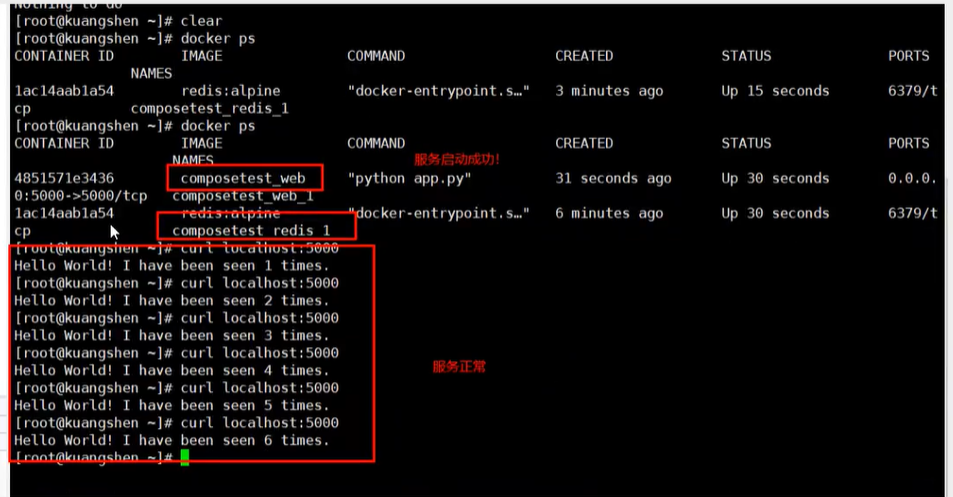
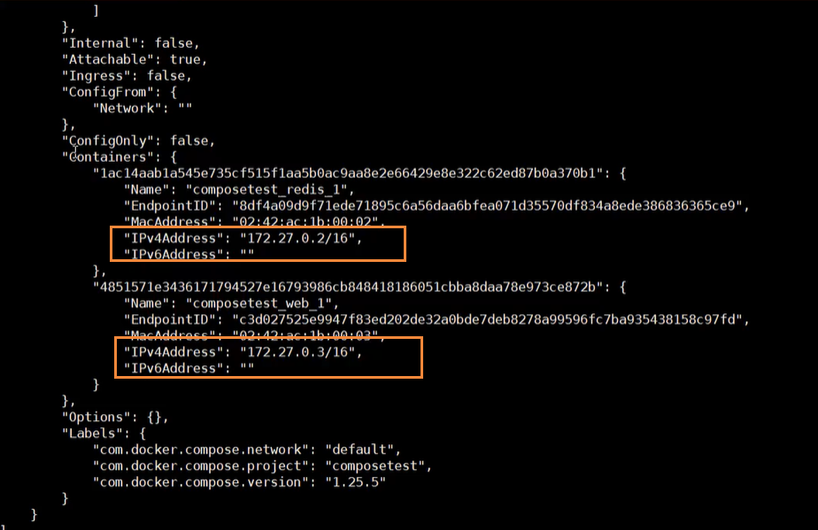

# Docker  Compose


## 1、简介

​	`Docker Compose` 是一个用来定义和运行复杂应用的 Docker 工具。一个使用 `Docker` 容器的应用，通常由多个容器组成。使用Docker Compose 不再需要使用 shell 脚本来启动容器。
​	`Compose`  通过一个配置文件来管理多个 `Docker` 容器，在配置文件中，所有的容器通过 `services` 来定义，然后使用 `docker-compose` 脚本来启动，停止和重启应用，和应用中的服务以及所有依赖服务的容器，非常适合组合使用多个容器进行开发的场景。

​	操作 `Docker` 的过程是：`DockerFile`   `build run`  进行手动操作，单个容器，如果假设有100个微服务，并行微服务之间还存在依赖关系。这个时候就可以使用 `Docker Compose` 来轻松高效的管理容器，定义运行多个容器。

**Compose 和 Docker 兼容性**

| compose文件格式版本 | docker版本 |
| ------------------- | ---------- |
| 3.4                 | 17.09.0+   |
| 3.3                 | 17.06.0+   |
| 3.2                 | 17.04.0+   |
| 3.1                 | 1.13.1+    |
| 3.0                 | 1.13.0+    |
| 2.3                 | 17.06.0+   |
| 2.2                 | 1.13.0+    |
| 2.1                 | 1.12.0+    |
| 2.0                 | 1.10.0+    |
| 1.0                 | 1.9.1.+    |

### 1.1 官方介绍

- 定义、运行多个容器
- YAML file配置环境

> Compose是一个用于定义和运行多容器Docker应用程序的工具。使用Compose，您可以使用YAML文件来配置应用程序的服务。然后，使用一个命令，就可以从配置中创建并启动所有服务。要了解有关Compose的所有特性的更多信息，请参阅[特性列表](https://docs.docker.com/compose/#features)。
>
> Compose可以在所有环境中工作:生产、阶段、开发、测试，以及CI工作流。您可以在常见用例中了解关于每个用例的更多信息
>
> 使用Compose基本上有三个步骤:
>
> - 用 Dockerfile 定义你的应用程序的环境，这样它就可以在任何地方复制。
> - 在 Docker-compose 中定义组成应用程序的服务。这样它们就可以在一个独立的环境中一起运行。
> - 运行 docker-compose up 和 Compose 启动并运行整个应用程序。

### 1.2 作用

批量容器编排

> Compose是Docker官方的开源项目，需要安装！
>
> Dockerfile 让程序在任何地方运行，web服务。Redis、MySQL、Nginx。。。多个容器

Compose 的 `YAML` 文件如下所示

```yaml
version: '2.0'
services:
  web:
    build: .
    ports:
    - "5000:5000"
    volumes:
    - .:/code
    - logvolume01:/var/log
    links:
    - redis
  redis:
    image: redis
volumes:
  logvolume01: {}
```

Compose：重要的概念

- 服务service，容器，应用（web，redis，mysql）
- 项目project，就是一组关联的容器。

### 1.3 常见的 Docker Compose 脚本

下面这个是小伙伴开源的一些 `Docker Compose` 脚本，如果需要部署某个应用的时候，可以通过下面脚本，非常方便的进行部署

https://gitee.com/zhengqingya/docker-compose


## 2、安装 Docker Compose

官方文档：https://docs.docker.com/compose/install/

### 2.1 下载

首先我们先安装一下 `Docker` 

```bash
# yum安装
yum -y install docker-ce
#查看docker版本
docker --version  
# 设置开机自启
systemctl enable docker
# 启动docker
systemctl start docker
```

然后下载 ` docker-compose` 

```bash
curl -L https://github.com/docker/compose/releases/download/v2.17.2/docker-compose-`uname -s`-`uname -m` -o /usr/local/bin/docker-compose

# 若是github访问太慢，可以用daocloud下载 (或者使用 这个)
curl -L https://get.daocloud.io/docker/compose/releases/download/v2.17.2/docker-compose-`uname -s`-`uname -m` -o /usr/local/bin/docker-compose

curl http://baobao66.club:9009/download/sources/docker-compose-linux-x86_64 -o /usr/local/bin/docker-compose

# 添加可执行权限
chmod +x /usr/local/bin/docker-compose

docker compose --version


### Ubuntu
# curl https://download.docker.com/linux/ubuntu/dists/$(lsb_release --codename | cut -f2)/pool/stable/$(dpkg --print-architecture)/docker-compose-plugin_2.6.0~ubuntu-focal_amd64.deb -o docker-compose-plugin.deb
sudo curl -L "https://github.com/docker/compose/releases/latest/download/docker-compose-$(uname -s)-$(uname -m)" -o /usr/local/bin/docker-compose

sudo chmod +x /usr/local/bin/docker-compose

# sudo apt install -i ./docker-compose-plugin.deb


###  pip 安装
pip install docker-compose

### YUM
yum install docker-compose-plugin Or sudo apt install docker-compose-plugin
```


###  2.2 初体验

在这个页面中，您将构建一个运行在 `Docker` 撰写器上的简单 `Python web` 应用程序。该应用程序使用了烧瓶框架，并在 Redis 中维护了一个命中计数器。虽然示例使用 Python，但是即使您不熟悉它，这里演示的概念也应该可以理解。

确保已经安装了 Docker 引擎和 Docker 组合。不需要安装Python或Redis，因为它们都是由 `Docker images` 提供的

```bash
# 创建文件夹
mkdir composetest
# 进入该文件夹
cd composetest
```

然后我们需要创建一个 app.py 文件

```bash
import time

import redis
from flask import Flask

app = Flask(__name__)
cache = redis.Redis(host='redis', port=6379)


def get_hit_count():
    retries = 5
    while True:
        try:
            return cache.incr('hits')
        except redis.exceptions.ConnectionError as exc:
            if retries == 0:
                raise exc
            retries -= 1
            time.sleep(0.5)


@app.route('/')
def hello():
    count = get_hit_count()
    return 'Hello World! I have been seen {} times.\n'.format(count)
```

然后创建一个 requirements.txt 文件，里面需要依赖包

```py
flask
redis
```

**创建 Dockerfile**

在这个步骤中，您将编写一个构建Docker映像的Dockerfile。该映像包含Python应用程序需要的所有依赖项，包括Python本身。在您的项目目录中，创建一个名为Dockerfile的文件，并粘贴以下内容:

```bash
FROM python:3.7-alpine
WORKDIR /code
ENV FLASK_APP app.py
ENV FLASK_RUN_HOST 0.0.0.0
RUN apk add --no-cache gcc musl-dev linux-headers
COPY requirements.txt requirements.txt
RUN pip install -r requirements.txt
EXPOSE 5000
COPY . .
CMD ["flask", "run"]
```

> 上述代码中，是为了告诉Docker
>
> 从Python3.7版本开始构建镜像
>
> 将当前目录设置为 /code
>
> 安装python依赖项
>
> 将容器的默认命令设置为 python app.py

**Compose 文件定义服务**

创建一个名为 `docker-compose` 的文件。yml 在项目目录，并粘贴以下

```bash
version: '3'
services:
  web:
    build: .
    ports:
      - "5000:5000"
  redis:
    image: "redis:alpine"
```

> 此Compose文件定义了两个服务，web和redis，该web服务使用从Docker file当前目录中构建的镜像
>
> 将容器上的公开端口5000

这个合成文件定义了两个服务:web和redis。

**使用 Compose 构建和运行应用程序**

在项目目录中，通过运行启动应用程序  `docker-compose up`.

```bash
docker-compose up
```

运行结果如下

```bash
Creating network "composetest_default" with the default driver
Creating composetest_web_1 ...
Creating composetest_redis_1 ...
Creating composetest_web_1
Creating composetest_redis_1 ... done
Attaching to composetest_web_1, composetest_redis_1
web_1    |  * Running on http://0.0.0.0:5000/ (Press CTRL+C to quit)
redis_1  | 1:C 17 Aug 22:11:10.480 # oO0OoO0OoO0Oo Redis is starting oO0OoO0OoO0Oo
redis_1  | 1:C 17 Aug 22:11:10.480 # Redis version=4.0.1, bits=64, commit=00000000, modified=0, pid=1, just started
redis_1  | 1:C 17 Aug 22:11:10.480 # Warning: no config file specified, using the default config. In order to specify a config file use redis-server /path/to/redis.conf
web_1    |  * Restarting with stat
redis_1  | 1:M 17 Aug 22:11:10.483 * Running mode=standalone, port=6379.
redis_1  | 1:M 17 Aug 22:11:10.483 # WARNING: The TCP backlog setting of 511 cannot be enforced because /proc/sys/net/core/somaxconn is set to the lower value of 128.
web_1    |  * Debugger is active!
redis_1  | 1:M 17 Aug 22:11:10.483 # Server initialized
redis_1  | 1:M 17 Aug 22:11:10.483 # WARNING you have Transparent Huge Pages (THP) support enabled in your kernel. This will create latency and memory usage issues with Redis. To fix this issue run the command 'echo never > /sys/kernel/mm/transparent_hugepage/enabled' as root, and add it to your /etc/rc.local in order to retain the setting after a reboot. Redis must be restarted after THP is disabled.
web_1    |  * Debugger PIN: 330-787-903
redis_1  | 1:M 17 Aug 22:11:10.483 * Ready to accept connections
```

最后查看服务是否启动成功



使用 docker images命令，我们发现在docker compose中的镜像都已经下载好了


**网络规则**

使用下面的命令，就可以查看到 docker 中的网络

```bash
docker network ls
```


通过compose构建的服务，compose帮我们维护了，都会在一个网络下面，就可以通过域名访问

我们通过以下命令来进行查看，发现启动的两个服务，就是同处于同一个网络下的

```bash
docker network inspect composetest_default
```



### 2.3 关闭 docker compose

可以使用一下命令退出

```bash
docker-compose down
# 或者
ctrl + c
```

### 2.4 yaml 规则

`docker-compose.yaml` 规则

```bash
# 三层
version: "3.8"  # 定义版本
services:       # 定义服务
   服务1:web
       images
       build
       network
	   ......
   服务2:redis
   		.....
   服务3:nginx
   		.....
  # 其它配置 网络/卷、全局规则
  volumes:
  networks:
  configs:  
```

完整实例如下

```yaml
version: "3.8"
services:
  redis:
    image: redis:latest
    deploy:
      replicas: 1
    configs:
      - my_config
      - my_other_config
configs:
  my_config:
    file: ./my_config.txt
  my_other_config:
    external: true
```

### 2.5 依赖关系

如果项目还有依赖关系，比如  web 依赖于 redis，也就是说项目需要首先启动 `redis` 

```yaml
version: "3.8"
services:
  web:
    build: .
    depends_on:
      - db
      - redis
  redis:
    image: redis
  db:
    image: postgres
```


## 3、文件结构和示例

```yaml
version: "3"
services:
 
  redis:
    image: redis:alpine
    ports:
      - "6379"
    networks:
      - frontend
    deploy:
      replicas: 2
      update_config:
        parallelism: 2
        delay: 10s
      restart_policy:
        condition: on-failure
 
  db:
    image: postgres:9.4
    volumes:
      - db-data:/var/lib/postgresql/data
    networks:
      - backend
    deploy:
      placement:
        constraints: [node.role == manager]
 
  vote:
    image: dockersamples/examplevotingapp_vote:before
    ports:
      - 5000:80
    networks:
      - frontend
    depends_on:
      - redis
    deploy:
      replicas: 2
      update_config:
        parallelism: 2
      restart_policy:
        condition: on-failure
 
  result:
    image: dockersamples/examplevotingapp_result:before
    ports:
      - 5001:80
    networks:
      - backend
    depends_on:
      - db
    deploy:
      replicas: 1
      update_config:
        parallelism: 2
        delay: 10s
      restart_policy:
        condition: on-failure
 
  worker:
    image: dockersamples/examplevotingapp_worker
    networks:
      - frontend
      - backend
    deploy:
      mode: replicated
      replicas: 1
      labels: [APP=VOTING]
      restart_policy:
        condition: on-failure
        delay: 10s
        max_attempts: 3
        window: 120s
      placement:
        constraints: [node.role == manager]
 
  visualizer:
    image: dockersamples/visualizer:stable
    ports:
      - "8080:8080"
    stop_grace_period: 1m30s
    volumes:
      - "/var/run/docker.sock:/var/run/docker.sock"
    deploy:
      placement:
        constraints: [node.role == manager]
 
networks:
  frontend:
  backend:
 
volumes:
  db-data:
```


### 3.1 快速搭建 WordPress

官网搭建文档：https://docs.docker.com/compose/wordpress/

首先创建项目的文件夹

```bash
# 创建文件夹
mkdir my_wordpress
# 进入文件夹
cd my_wordpress/
```

然后创建一个 docker-compose.yml 文件

```yaml
version: '3.3' # 定义版本

services:
   db:
     image: mysql:5.7
     volumes:
       - db_data:/var/lib/mysql
     restart: always
     environment:
       MYSQL_ROOT_PASSWORD: somewordpress
       MYSQL_DATABASE: wordpress
       MYSQL_USER: wordpress
       MYSQL_PASSWORD: wordpress

   wordpress:
     depends_on:  # 依赖于上一个db，也就是需要db启动
       - db
     image: wordpress:latest
     ports:
       - "8000:80"
     restart: always
     environment:
       WORDPRESS_DB_HOST: db:3306
       WORDPRESS_DB_USER: wordpress
       WORDPRESS_DB_PASSWORD: wordpress
       WORDPRESS_DB_NAME: wordpress
volumes:
    db_data: {}
```

后台启动项目

```bash
docker-compose  -d
```

> 正常的开源项目，可能还需要依赖 build 后的 jar 包，所以还需要使用 Dockerfile
>
> 当的文件准备齐全的时候，就可以一键启动项目

掌握：docker基础、原理、网络、服务、集群、错误排查、日志


## 4、Compose 常用服务配置参考

​	Compose 文件是一个定义服务，网络和卷的 `YAML`文件。 Compose 文件的默认文件名为 `docker-compose.yml` 。

> 提示：您可以对此文件使用.yml或.yaml扩展名。 他们都工作。

​	与 `docker` 运行一样，默认情况下，`Dockerfile` 中指定的选项（例如，CMD，EXPOSE，VOLUME，ENV）都被遵守，你不需要在 `docker-compose.yml` 中再次指定它们。

​	同时可以使用类似Bash的 `$ {VARIABLE} ` 语法在配置值中使用环境变量，有关详细信息，请参阅[变量替换](https://docs.docker.com/compose/compose-file/#variable-substitution)。

## 5. compose常用服务配置参考

Compose文件是一个定义服务，网络和卷的YAML文件。 Compose文件的默认文件名为docker-compose.yml。

> 提示：您可以对此文件使用.yml或.yaml扩展名。 他们都工作。

与docker运行一样，默认情况下，Dockerfile中指定的选项（例如，CMD，EXPOSE，VOLUME，ENV）都被遵守，你不需要在docker-compose.yml中再次指定它们。

同时你可以使用类似Bash的$ {VARIABLE} 语法在配置值中使用环境变量，有关详细信息，请参阅[变量替换](https://docs.docker.com/compose/compose-file/#variable-substitution)。

本节包含版本3中服务定义支持的所有配置选项。

### 5.1 build

build 可以指定包含构建上下文的路径：

```vbnet
version: '2'
services:
  webapp:
    build: ./dir
```

或者，作为一个对象，该对象具有上下文路径和指定的Dockerfile文件以及args参数值：

```vbnet
version: '2'
services:
  webapp:
    build:
      context: ./dir
      dockerfile: Dockerfile-alternate
      args:
        buildno: 1
```

webapp服务将会通过./dir目录下的Dockerfile-alternate文件构建容器镜像。
如果你同时指定image和build，则compose会通过build指定的目录构建容器镜像，而构建的镜像名为image中指定的镜像名和标签。

```vbnet
build: ./dir
image: webapp:tag
```

这将由./dir构建的名为webapp和标记为tag的镜像。

**context**
包含Dockerfile文件的目录路径，或者是 `git` 仓库的URL
当提供的值是相对路径时，它被解释为相对于当前compose文件的位置。 该目录也是发送到 `Docker` 守护程序构建镜像的上下文。

**dockerfile**
备用 Docker 文件。Compose 将使用备用文件来构建。 还必须指定构建路径。

**args**
添加构建镜像的参数，环境变量只能在构建过程中访问。
首先，在Dockerfile中指定要使用的参数：

```bash
ARG buildno
ARG password
 
RUN echo "Build number: $buildno"
RUN script-requiring-password.sh "$password"
```

然后在args键下指定参数。 你可以传递映射或列表：

```vbnet
build:
  context: .
  args:
    buildno: 1
    password: secret
 
build:
  context: .
  args:
    - buildno=1
    - password=secret
```

> ** 注意：YAML布尔值（true，false，yes，no，on，off）必须用引号括起来，以便解析器将它们解释为字符串。

### 5.2 image

指定启动容器的镜像，可以是镜像仓库/标签或者镜像 `id` （或者 `id` 的前一部分）

```vbnet
image: redis
image: ubuntu:14.04
image: tutum/influxdb
image: example-registry.com:4000/postgresql
image: a4bc65fd
```

如果镜像不存在，Compose将尝试从官方镜像仓库将其pull下来，如果你还指定了build，在这种情况下，它将使用指定的build选项构建它，并使用image指定的名字和标记对其进行标记。

### 5.3 container_name

指定一个自定义容器名称，而不是生成的默认名称。

```vbnet
container_name: my-web-container
```

由于Docker容器名称必须是唯一的，因此如果指定了自定义名称，则无法将服务扩展到多个容器。

### 5.4 volumes

卷挂载路径设置。可以设置宿主机路径 （HOST:CONTAINER） 或加上访问模式 （HOST:CONTAINER:ro）,挂载数据卷的默认权限是读写（rw），可以通过ro指定为只读。
你可以在主机上挂载相对路径，该路径将相对于当前正在使用的Compose配置文件的目录进行扩展。 相对路径应始终以 . 或者 .. 开始。

```bash
volumes:
  # 只需指定一个路径，让引擎创建一个卷
  - /var/lib/mysql
 
  # 指定绝对路径映射
  - /opt/data:/var/lib/mysql
 
  # 相对于当前compose文件的相对路径
  - ./cache:/tmp/cache
 
  # 用户家目录相对路径
  - ~/configs:/etc/configs/:ro
 
  # 命名卷
  - datavolume:/var/lib/mysql
```

但是，如果要跨多个服务并重用挂载卷，请在顶级volumes关键字中命名挂在卷，但是并不强制，如下的示例亦有重用挂载卷的功能，但是不提倡。

```bash
version: "3"
 
services:
  web1:
    build: ./web/
    volumes:
      - ../code:/opt/web/code
  web2:
    build: ./web/
    volumes:
      - ../code:/opt/web/code
```

> ** 注意：通过顶级volumes定义一个挂载卷，并从每个服务的卷列表中引用它， 这会替换早期版本的Compose文件格式中volumes_from。


```haskell
version: "3"
 
services:
  web1:
    build: ./web/
    volumes:
      - ../code:/opt/web/code
  web2:
    build: ./web/
    volumes:
      - ../code:/opt/web/code
```

### 5.5 command

覆盖容器启动后默认执行的命令。

```bash
command: bundle exec thin -p 3000
```

该命令也可以是一个类似于dockerfile的列表：

```vbnet
command: ["bundle", "exec", "thin", "-p", "3000"]
```

### 5.6 links

链接到另一个服务中的容器。 请指定服务名称和链接别名（SERVICE：ALIAS），或者仅指定服务名称。

```vbnet
web:
  links:
   - db
   - db:database
   - redis
```

在当前的web服务的容器中可以通过链接的db服务的别名database访问db容器中的数据库应用，如果没有指定别名，则可直接使用服务名访问。

链接不需要启用服务进行通信 - 默认情况下，任何服务都可以以该服务的名称到达任何其他服务。 （实际是通过设置/etc/hosts的域名解析，从而实现容器间的通信。故可以像在应用中使用localhost一样使用服务的别名链接其他容器的服务，前提是多个服务容器在一个网络中可路由联通）

links也可以起到和depends_on相似的功能，即定义服务之间的依赖关系，从而确定服务启动的顺序。

### 5.7 external_links

链接到docker-compose.yml 外部的容器，甚至并非 Compose 管理的容器。参数格式跟 links 类似。

```vbnet
external_links:
 - redis_1
 - project_db_1:mysql
 - project_db_1:postgresql
```

### 5.8 expose

暴露端口，但不映射到宿主机，只被连接的服务访问。
仅可以指定内部端口为参数

```vbnet
expose:
 - "3000"
 - "8000"
```

### 5.9 ports

暴露端口信息。
常用的简单格式：使用宿主：容器 （HOST:CONTAINER）格式或者仅仅指定容器的端口（宿主将会随机选择端口）都可以。

> ** 注意：当使用 HOST:CONTAINER 格式来映射端口时，如果你使用的容器端口小于 60 你可能会得到错误得结果，因为 YAML 将会解析 xx:yy 这种数字格式为 60 进制。所以建议采用字符串格式。


简单的短格式：

```vbnet
ports:
 - "3000"
 - "3000-3005"
 - "8000:8000"
 - "9090-9091:8080-8081"
 - "49100:22"
 - "127.0.0.1:8001:8001"
 - "127.0.0.1:5000-5010:5000-5010"
 - "6060:6060/udp"
```

在v3.2中ports的长格式的语法允许配置不能用短格式表示的附加字段。
长格式：

```vbnet
ports:
  - target: 80
    published: 8080
    protocol: tcp
    mode: host
```

target：容器内的端口
published：物理主机的端口
protocol：端口协议（tcp或udp）
mode：host 和ingress 两总模式，host用于在每个节点上发布主机端口，ingress 用于被负载平衡的swarm模式端口。

### 5.10 restart

no是默认的重启策略，在任何情况下都不会重启容器。 指定为always时，容器总是重新启动。 如果退出代码指示出现故障错误，则on-failure将重新启动容器。

```vbnet
restart: "no"
restart: always
restart: on-failure
restart: unless-stopped
```

### 5.11 environment

添加环境变量。 你可以使用数组或字典两种形式。 任何布尔值; true，false，yes，no需要用引号括起来，以确保它们不被YML解析器转换为True或False。
只给定名称的变量会自动获取它在 Compose 主机上的值，可以用来防止泄露不必要的数据。

```sql
environment:
  RACK_ENV: development
  SHOW: 'true'
  SESSION_SECRET:
 
environment:
  - RACK_ENV=development
  - SHOW=true
  - SESSION_SECRET
```

> ** 注意：如果你的服务指定了build选项，那么在构建过程中通过environment定义的环境变量将不会起作用。 将使用build的args子选项来定义构建时的环境变量。


### 5.12 pid

将PID模式设置为主机PID模式。 这就打开了容器与主机操作系统之间的共享PID地址空间。 使用此标志启动的容器将能够访问和操作裸机的命名空间中的其他容器，反之亦然。即打开该选项的容器可以相互通过进程 ID 来访问和操作。

```vbnet
pid: "host"
```

### 5.13 dns

配置 DNS 服务器。可以是一个值，也可以是一个列表。

```vbnet
dns: 8.8.8.8
dns:
  - 8.8.8.8
  - 9.9.9.9
```

## 6、FAQ

`vim /etc/yum.repos.d/kubernetes.repo`

```yaml
[kubernetes]
name=Kubernetes
baseurl=http://mirrors.aliyun.com/kubernetes/yum/repos/kubernetes-el7-x86_64
enabled=1
gpgcheck=0
repo_gpgcheck=0
gpgkey=http://mirrors.aliyun.com/kubernetes/yum/doc/yum-key.gpg http://mirrors.aliyun.com/kubernetes/yum/doc/rpm-package-key.gpg
```


## 7、参考

https://www.bilibili.com/video/BV1kv411q7Qc