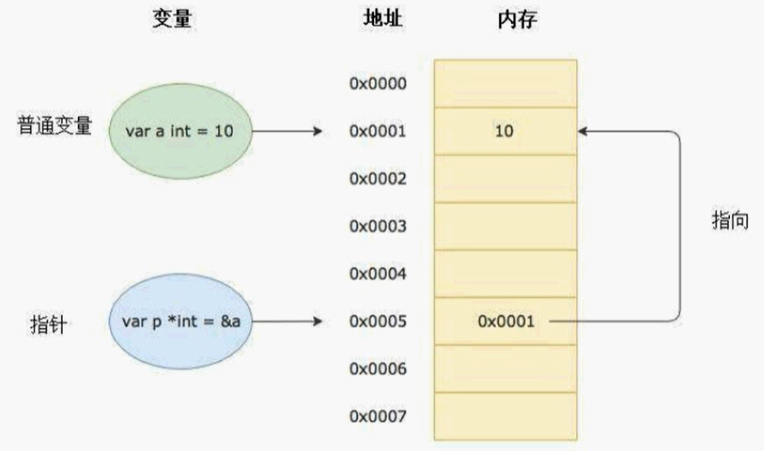
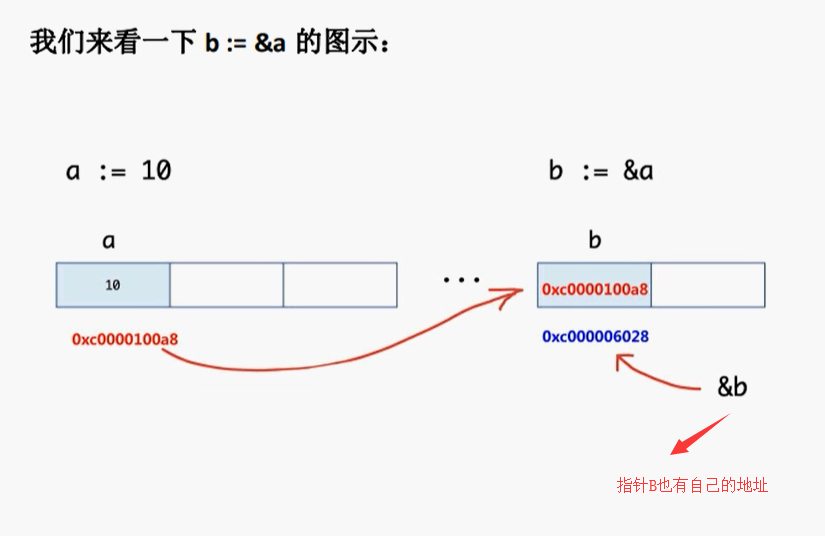

# Go中的指针

要搞明白Go语言中的指针需要先知道三个概念

- 指针地址
- 指针类型
- 指针取值

Go语言中的指针操作非常简单，只需要记住两个符号：&：取地址，*：根据地址取值

## 关于指针

​	变量是用来存储数据的，变量的本质是给存储数据的内存地址起了一个好记的别名。比如定义了一个变量 `a:=10` ，这个时候可以直接通过 `a` 这个变量来读取内存中保存的 10 这个值。在计算机底层 `a` 这个变量其实对应了一个内存地址。

​	指针也是一个变量，但它是一种特殊的变量，它存储的数据不是一个普通的值，而是另一个变量的内存地址。



## 指针地址和指针类型

​	每个变量在运行时都拥有一个地址，这个地址代表变量在内存中的位置。Go 语言中使用 &字符 放在变量前面对变量进行取地址操作。Go语言中的值类型（int、float、bool、string、array、struct）都有对应的指针类型，如：

```
*int、，*int64、*string etc...
```

取变量指针的语法如下：

```go
ptr := &v
```

其中：

- v：代表被取地址的变量，类型为 T
- ptr：用于接收地址的变量，ptr 的类型就为 *T，被称做 T 的指针类型。\* 代表指针

举个栗子：



## 指针取值

在对普通变量进行 & 操作符取地址后，会获得这个变量指针，然后可以对指针使用 * 操作，也就是指针取值

```go
// 指针取值
var c = 20
// 得到 c 的地址，赋值给 d
var d = &c
// 打印 d 的值，也就是 c 的地址
fmt.Println(d)
// 取出 d 指针所对应的值
fmt.Println(*d)
// c 对应地址的值，改成 30
*d = 30
// c 已经变成 30 了
fmt.Println(c)
```

> 改变内存中的值，会直接改变原来的变量值

```go
// 这个类似于 值传递
func fn4(x int) {
	x = 10
}
// 这个类似于 引用数据类型
func fn5(x *int) {
	*x = 20
}
func main() {
	x := 5
	fn4(x)
	fmt.Println(x)	// 5
	fn5(&x)
	fmt.Println(x)	// 20
}
```

## new 和 make 函数

需要注意的是，指针必须在创建内存后才可以使用，这个和 slice 和 map 是一样的

```go
// 引用数据类型 map、slice 等，必须使用 make 分配空间，才能够使用
var userInfo = make(map[string]string)
userInfo["userName"] = "zhangsan"
fmt.Println(userInfo)

var array = make([]int, 4, 4)
array[0] = 1
fmt.Println(array)
```

对于指针变量来说

```go
// 指针变量初始化
var a *int
*a = 100
fmt.Println(a)
```

​	执行上面的代码会引发panic
​	在Go语言中对于引用类型的变量，在使用的时候不仅要声明它，还要为它分配内存空间，否则值就没办法存储。
​	而对于值类型的声明不需要分配内存空间，是因为它们在声明的时候已经默认分配好了内存空间。要分配内存，就需要 `new` 和`make` 。Go 语言中 `new` 和 `make` 是内建的两个函数，主要用来分配内存。

这个时候，就需要使用 `new` 关键字来分配内存，`new` 是一个内置的函数，它的函数签名如下：

```go
func new(Type) *Type
```

其中

- Type 表示类型，new 函数只接受一个参数，这个参数是一个类型
- *Type 表示类型指针，new 函数返回一个指向该类型内存地址的指针

实际开发中 new 函数不太常用，使用 new 函数得到的是一个类型的指针，并且该指针对应的值为该类型的零值。举个例子：

```go
// 使用new关键字创建指针
aPoint := new(int)
bPoint := new(bool)
fmt.Printf("%T \n", aPoint)
fmt.Printf("%T \n", bPoint)
fmt.Println(*aPoint)
fmt.Println(*bPoint)
```

​	本节开始的示例代码中  `var a *int` 只是声明了一个指针变量 `a` 但是没有初始化，指针作为引用类型需要初始化后才会拥有内存空间，才可以给它赋值。

## make 和 new 的区别

- 两者都是用来做内存分配
- make 只能用于 slice、map 以及 channel 的初始化，返回的还是这三个引用类型的本身
- 而 new 用于类型的内存分配，并且内存分配的值为类型的零值，返回的是指向类型的指针