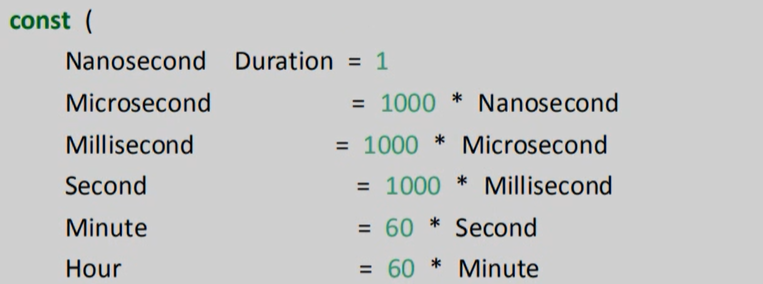

# Go中的日期函数

## time 包

时间和日期是我们编程中经常会用到的，在 golang 中 time 包提供了时间的显示和测量用的函数

## time.Now 获取当前时间

```go
timeObj := time.Now()
year := timeObj.Year()
month := timeObj.Month()
day := timeObj.Day()
fmt.Printf("%d-%02d-%02d \n", year, month, day)	// 2023-10-06
```

## 格式化日期

时间类型有一个自带的方法 `Format` 进行格式化

- 需要注意的是Go语言中格式化时间模板不是 长久的 Y-m-d H:M:S
- 而是使用 Go 的诞生时间 2006年1月2日 15点04分 （记忆口诀：2006 1 2 3 4 5）

```go
// 时间类型 自带的方法 Format 进行格式化
timeObj2 := time.Now()
// 24小时值  （15表示二十四小时）
fmt.Println(timeObj2.Format("2006-01-02 15:04:05"))	// 后面的 字符串 是 时制模板
// 12小时制
fmt.Println(timeObj2.Format("2006-01-02 03:04:05"))
```

## 获取当前时间戳

时间戳是自1070年1月1日（08:00:00GMT）至当前时间的总毫秒数。它也被称为Unix时间戳

```go
/**
	获取当前时间戳
 */
timeObj3 := time.Now()
// 获取 秒 时间戳
unixTime := timeObj3.Unix()	// 1696604109
// 获取 毫秒 时间戳
unixTime := timeObj3.UnixMilli()
// 获取 微秒 时间戳
unixTime := timeObj3.UnixMicro()
// 获取纳秒时间戳
unixNaTime := timeObj3.UnixNano()	// 1696604109494519500
```

## 时间戳转日期字符串

通过将时间戳	可以转换成日期字符串

```go
// 时间戳转换年月日时分秒（一个参数是秒，另一个参数是毫秒）
var timeObj4 = time.Unix(1595289901, 0)
var timeStr = timeObj4.Format("2006-01-02 15:04:05")
fmt.Println(timeStr)
```

## 日期字符串转换成时间戳

```go
// 日期字符串转换成时间戳
var timeStr2 = "2020-07-21 08:10:05";
var tmp = "2006-01-02 15:04:05"
timeObj5, _ := time.ParseInLocation(tmp, timeStr2, time.Local)
fmt.Println(timeObj5.Unix())
```

## 时间间隔

`time.Duration` 是 `time` 包定义的一个类型，它代表两个时间点之间经过的时间，以纳秒为单位。`time.Duration` 表示一段时间间隔，可表示的最大长度段大约 290 年

`time` 包中定义的时间间隔类型的常量如下：



## 时间操作函数

在日常的编码过程中可能会遇到要求 `时间+时间间隔` 的需求，Go语言的时间对象有提供 `Add` 方法如下

```go
func (t Time) Add(d Duration)Time
```

```go
// 时间相加
now := time.Now()
// 当前时间加1个小时后
later := now.Add(time.Hour)
fmt.Println(later)
```

> 同理的方法还有：时间差、判断相等

## 定时器

方式1：使用 `time.NewTicker`（时间间隔）来设置定时器

```go
// 定时器, 定义一个1秒间隔的定时器
ticker := time.NewTicker(time.Second)
n := 0
for i := range ticker.C {
    fmt.Println(i)
    n++
    if n > 5 {
        // 终止定时器
        ticker.Stop()
        return
    }
}
```

方式2：`time.Sleep(time.Second)` 来实现定时器

```go
for  {
    time.Sleep(time.Second)
    fmt.Println("一秒后")
}
```

