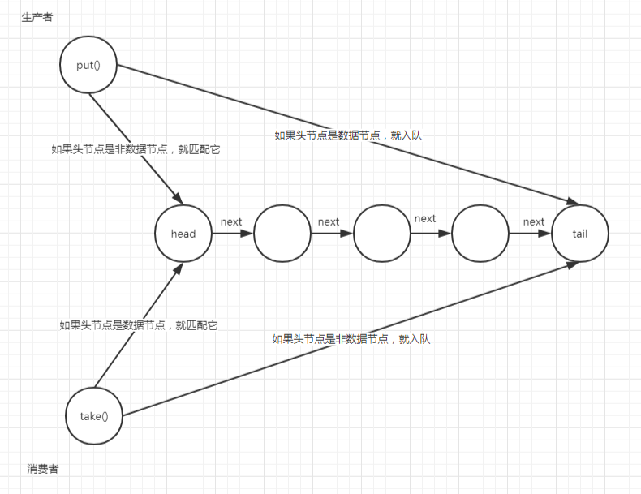

# AtomicXXX类


​		Java1.5的Atomic包名为java.util.concurrent.atomic。这个包提供了一系列原子类。这些类可以保证多线程环境下，当某个线程在执行 atomic 的方法时，不会被其他线程打断，而别的线程通过自旋锁（CAS），一直等到该方法执行完成，才由JVM从等待队列中选择一个线程执行。

​		Atomic类在软件层面上是非阻塞的，它的原子性其实是依靠底层的 CAS 来保障原子性的更新数据，在要添加或者减少的时候，会使用死循环不断地 CAS 到特定的值，从而达到更新数据的目的。

```java
```


## AtomicStampedReference

> `AtomicStampedReference` 是 java 并发包下提供的一个原子类，它能解决其它原子类无法解决的ABA问题。

### ABA

​	ABA问题发生在多线程环境中，当某线程连续读取同一块内存地址两次，两次得到的值一样，它简单地认为“此内存地址的值并没有被修改过”，然而，同时可能存在另一个线程在这两次读取之间把这个内存地址的值从A修改成了B又修改回了A，这时还简单地认为“没有修改过”显然是错误的。

比如，两个线程按下面的顺序执行：

（1）线程1读取内存位置X的值为A；

（2）线程1阻塞了；

（3）线程2读取内存位置X的值为A；

（4）线程2修改内存位置X的值为B；

（5）线程2又修改内存位置X的值为A；

（6）线程1恢复，继续执行，比较发现还是A把内存位置X的值设置为C；



> 可以看到，针对线程1来说，第一次的A和第二次的A实际上并不是同一个A

ABA问题通常发生在无锁结构中，用代码来表示上面的过程大概就是这样：

```java
public class ABATest {
 
    public static void main(String[] args) {
        AtomicInteger atomicInteger = new AtomicInteger(1);
 
        new Thread(()->{
            int value = atomicInteger.get();
            System.out.println("thread 1 read value: " + value);
 
            // 阻塞1s
            LockSupport.parkNanos(1000000000L);
 
            if (atomicInteger.compareAndSet(value, 3)) {
                System.out.println("thread 1 update from " + value + " to 3");
            } else {
                System.out.println("thread 1 update fail!");
            }
        }).start();
 
        new Thread(()->{
            int value = atomicInteger.get();
            System.out.println("thread 2 read value: " + value);
            if (atomicInteger.compareAndSet(value, 2)) {
                System.out.println("thread 2 update from " + value + " to 2");
 
                // do sth
 
                value = atomicInteger.get();
                System.out.println("thread 2 read value: " + value);
                if (atomicInteger.compareAndSet(value, 1)) {
                    System.out.println("thread 2 update from " + value + " to 1");
                }
            }
        }).start();
    }
}
```

> 打印结果为：
>
> thread 1 read value: 1
> thread 2 read value: 1
> thread 2 update from 1 to 2
> thread 2 read value: 2
> thread 2 update from 2 to 1
> thread 1 update from 1 to 3

### Solve ABA

大概有以下几种方式：

（1）版本号

​	比如，上面的栈结构增加一个版本号用于控制，每次CAS的同时检查版本号有没有变过。

​	还有一些数据结构喜欢使用高位存储一个邮戳来保证CAS的安全。

（2）不重复使用节点的引用

​	比如，上面的栈结构在线程2执行push()入栈操作的时候新建一个节点传入，而不是复用节点1的引用；

（3）直接操作元素而不是节点

​	比如，上面的栈结构push()方法不应该传入一个节点（Node），而是传入元素值（int的value）

​	

**源码分析**

```java
// 内部类	将元素值和版本号绑定在一起，存储在Pair的reference和stamp（邮票、戳的意思）中
private static class Pair<T> {
    final T reference;
    final int stamp;
    private Pair(T reference, int stamp) {
        this.reference = reference;
        this.stamp = stamp;
    }
    static <T> Pair<T> of(T reference, int stamp) {
        return new Pair<T>(reference, stamp);
    }
}

// 属性	声明一个Pair类型的变量并使用Unsfae获取其偏移量，存储到pairOffset中
private volatile Pair<V> pair;
private static final sun.misc.Unsafe UNSAFE = sun.misc.Unsafe.getUnsafe();
private static final long pairOffset = objectFieldOffset(UNSAFE, "pair", AtomicStampedReference.class);

// 构造方法	构造方法需要传入初始值及初始版本号
public AtomicStampedReference(V initialRef, int initialStamp) {
    pair = Pair.of(initialRef, initialStamp);
}
```

**CompareAndSet() 方法**

```java
public boolean compareAndSet(V   expectedReference,
                             V   newReference,
                             int expectedStamp,
                             int newStamp) {
    // 获取当前的（元素值，版本号）对
    Pair<V> current = pair;
    return
        // 引用没变
        expectedReference == current.reference &&
        // 版本号没变
        expectedStamp == current.stamp &&
        // 新引用等于旧引用
        ((newReference == current.reference &&
        // 新版本号等于旧版本号
          newStamp == current.stamp) ||
          // 构造新的Pair对象并CAS更新
         casPair(current, Pair.of(newReference, newStamp)));
}
 
private boolean casPair(Pair<V> cmp, Pair<V> val) {
    // 调用Unsafe的compareAndSwapObject()方法CAS更新pair的引用为新引用
    return UNSAFE.compareAndSwapObject(this, pairOffset, cmp, val);
}
```

（1）如果元素值和版本号都没有变化，并且和新的也相同，返回true；

（2）如果元素值和版本号都没有变化，并且和新的不完全相同，就构造一个新的Pair对象并执行CAS更新pair。

可以看到，java中的实现跟我们上面讲的ABA的解决方法是一致的。

首先，使用版本号控制；

其次，不重复使用节点（Pair）的引用，每次都新建一个新的Pair来作为CAS比较的对象，而不是复用旧的；

最后，外部传入元素值及版本号，而不是节点（Pair）的引用。


使用 `AtomicStampedReference` 解决开篇那个 `AtomicInteger` 带来的ABA问题：

```java
public class AtomicStampedReferenceTest {
 
    public static void main(String[] args) {
        testStamp();
    }
 
    private static void testStamp() {
        AtomicStampedReference<Integer> atomicStampedReference = new AtomicStampedReference<>(1, 1);
 
        new Thread(()->{
            int[] stampHolder = new int[1];
            int value = atomicStampedReference.get(stampHolder);
            int stamp = stampHolder[0];
            System.out.println("thread 1 read value: " + value + ", stamp: " + stamp);
 
            // 阻塞1s
            LockSupport.parkNanos(1000000000L);
 
            if (atomicStampedReference.compareAndSet(value, 3, stamp, stamp + 1)) {
                System.out.println("thread 1 update from " + value + " to 3");
            } else {
                System.out.println("thread 1 update fail!");
            }
        }).start();
 
        new Thread(()->{
            int[] stampHolder = new int[1];
            int value = atomicStampedReference.get(stampHolder);
            int stamp = stampHolder[0];
            System.out.println("thread 2 read value: " + value + ", stamp: " + stamp);
            if (atomicStampedReference.compareAndSet(value, 2, stamp, stamp + 1)) {
                System.out.println("thread 2 update from " + value + " to 2");
 
                // do sth
 
                value = atomicStampedReference.get(stampHolder);
                stamp = stampHolder[0];
                System.out.println("thread 2 read value: " + value + ", stamp: " + stamp);
                if (atomicStampedReference.compareAndSet(value, 1, stamp, stamp + 1)) {
                    System.out.println("thread 2 update from " + value + " to 1");
                }
            }
        }).start();
    }
}
```

> 运行结果为：
>
> thread 1 read value: 1, stamp: 1
> thread 2 read value: 1, stamp: 1
> thread 2 update from 1 to 2
> thread 2 read value: 2, stamp: 2
> thread 2 update from 2 to 1
> thread 1 update fail!
>
> 可以看到线程1最后更新1到3时失败了，因为这时版本号也变了，成功解决了ABA的问题。

### 总结

（1）在多线程环境下使用无锁结构要注意ABA问题；

（2）ABA的解决一般使用版本号来控制，并保证数据结构使用元素值来传递，且每次添加元素都新建节点承载元素值；

（3）AtomicStampedReference 内部使用Pair来存储元素值及其版本号.

> Java 中还有 `AtomicMarkableReference` 类可以解决ABA的问题
> 它不是维护一个版本号，而是维护一个boolean类型的标记，标记值有修改
