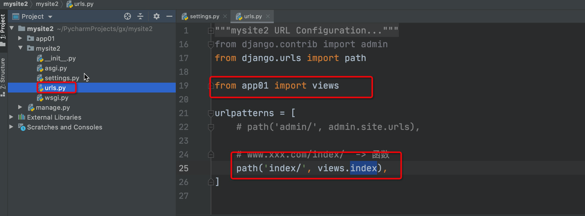
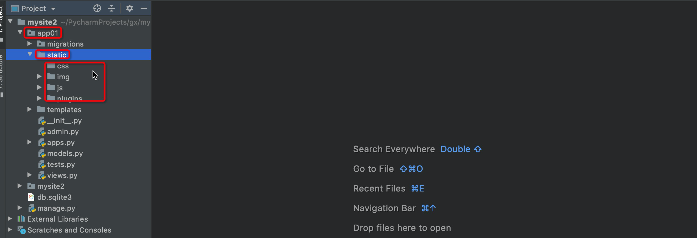
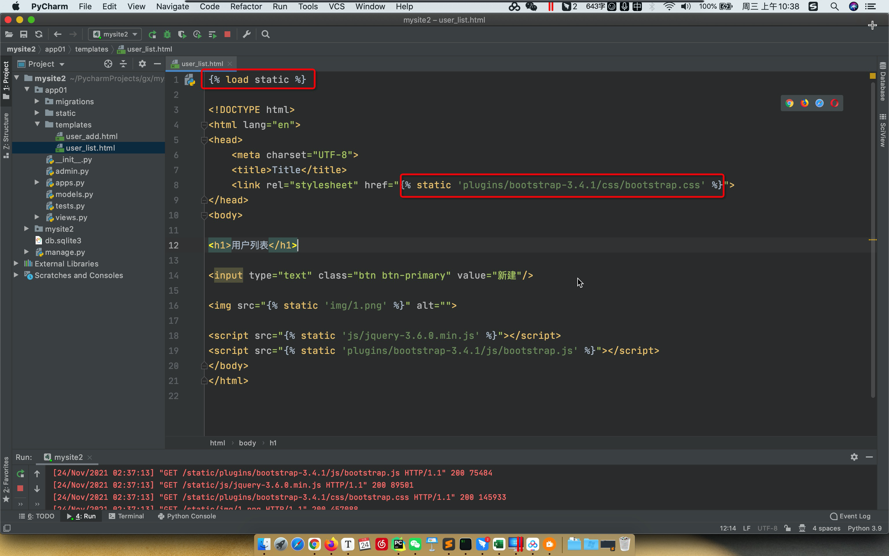
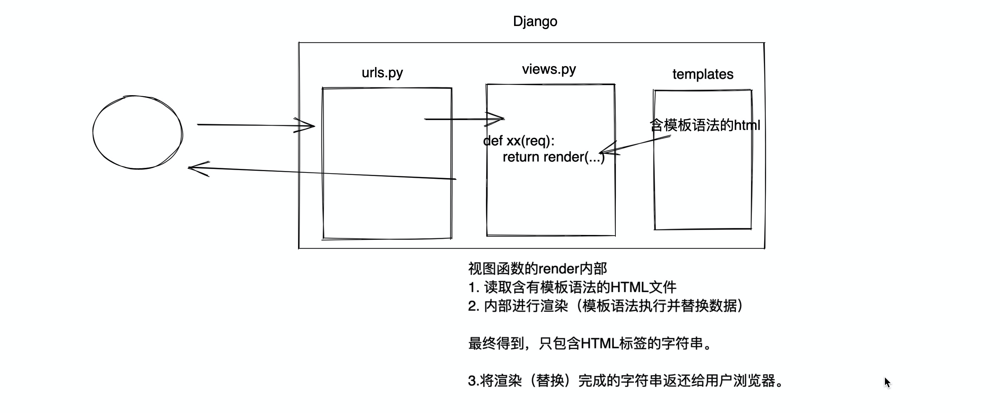
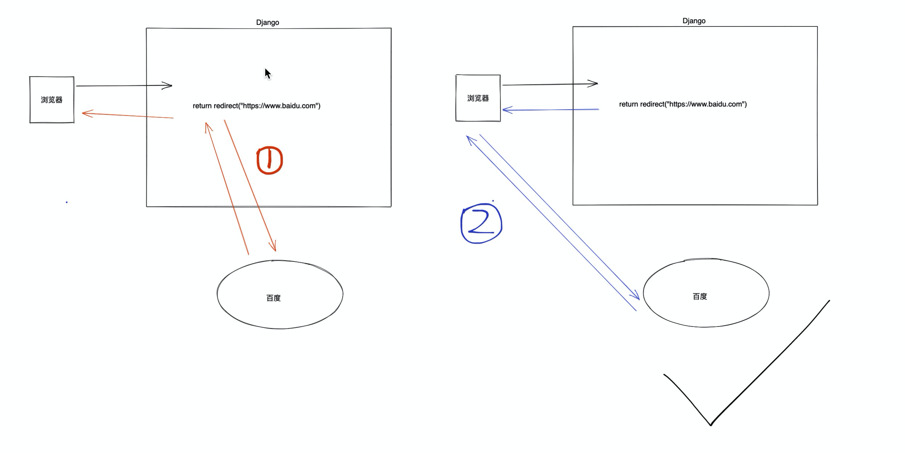

# Django

## 简介

- Python知识点：函数、面向对象
- 前端开发：HTML、CSS、JavaScript、jQuery、BootStrap
- MySQL数据库
- Python的Web框架：
  - Flask，自身短小精悍 + 第三方组件
  - Django，内部已集成了很多组件 +  第三方组件

**安装**

```
pip install django
```

**创建项目**

> django中项目会有一些默认的文件和默认的文件夹

**在终端**

- 打开终端

- 进入某个目录（项目放在哪里）

  ```
  /Users/wupeiqi/PycharmProjects/gx
  ```

- 执行命令创建项目

  ```
  "c:\python39\Scripts\django-admin.exe" startproject 项目名称
  ```

  ```
  # 如果 c:\python39\Scripts 已加入环境系统环境变量
  
  django-admin startproject 项目名称
  ```

  ```
  # 我自己的电脑
  /Library/Frameworks/Python.framework/Versions/3.9/bin/django-admin startproject mysite
  ```

**Pycharm**

注意：

```
- Python解释器安装目录：C:\python39\python.exe lib....
	/Library/Frameworks/Python.framework/Versions/3.9/
	
- F:\pycode\ (基于Django创建的项目)
	/Users/wupeiqi/PycharmProjects
```


特殊说明：

- 命令行，创建的项目是标准的

- pycharm，在标准的基础上默认给咱们加了点东西

  - 创建了一个templates目录【删除】

  - settings.py中【删除】
    

默认项目的文件介绍：

```
mysite
├── manage.py         【项目的管理，启动项目、创建app、数据管理】【不要动】【***常常用***】
└── mysite
    ├── __init__.py
    ├── settings.py    【项目配置】          【***常常修改***】
    ├── urls.py        【URL和函数的对应关系】【***常常修改***】
    ├── asgi.py        【接收网络请求】【不要动】
    └── wsgi.py        【接收网络请求】【不要动】
```

**创建 app**

```
python manage.py startapp <name>
- 项目
	- app，用户管理【表结构、函数、HTML模板、CSS】
	- app，订单管理【表结构、函数、HTML模板、CSS】
	- app，后台管理【表结构、函数、HTML模板、CSS】
	- app，网站    【表结构、函数、HTML模板、CSS】
	- app，API    【表结构、函数、HTML模板、CSS】
	..
	
注意：我们开发比较简洁，用不到多app，一般情况下，项目下创建1个app即可
```


```
├── app01
│   ├── __init__.py
│   ├── admin.py         【固定，不用动】django默认提供了admin后台管理。
│   ├── apps.py          【固定，不用动】app启动类
│   ├── migrations       【固定，不用动】数据库变更记录
│   │   └── __init__.py
│   ├── models.py        【**重要**】，对数据库操作。
│   ├── tests.py         【固定，不用动】单元测试
│   └── views.py         【**重要**】，函数。
├── manage.py
└── mysite2
    ├── __init__.py
    ├── asgi.py
    ├── settings.py
    ├── urls.py          【URL->函数】
    └── wsgi.py
```

## 快速上手

- 确保app已注册 【settings.py】
  

- 编写URL和视图函数对应关系 【urls.py】
  

- 编写视图函数 【views.py】
  

- 启动`django`项目

  - 命令行启动

    ```
    python manage.py runserver 
    ```

```
url -> 函数
```


**Templates 模板**

> 1. 优先去项目根目录的templates中寻找，settings 里配置
>
> 2. 根据app的注册顺序,在每个app下的templates目录中寻找


**static 目录**

在app目录下创建static文件夹



**引用静态文件**



## 模板语法

本质上：在HTML中写一些占位符，由数据对这些占位符进行替换和处理



```html
循环
<div>
    
        <span>{{ item }}</span>
    
</div>
<hr/>

字典
<ul>
     
        <li>{{ k }} = {{ v }} </li>
    
</ul>
<hr/>


    <h1>哒哒哒哒哒</h1>
    <h1>哒哒哒哒哒</h1>

    <h1>哔哔哔</h1>

    <h1>嘟嘟嘟嘟</h1>

```

```html
# 定义 共用母版
# 模板中 嵌入以下代码
<div>
    
</div>
<script src=""></script>


# 继承模板语法



    <div class="container">
    </div>



	<script src=""></script>

```

### Form

```python
class MyForm(Form):
    user = forms.CharField(widget=forms.Input)
    pwd = form.CharFiled(widget=forms.Input)
    email = form.CharFiled(widget=forms.Input)
    account = form.CharFiled(widget=forms.Input)
    create_time = form.CharFiled(widget=forms.Input)
    depart = form.CharFiled(widget=forms.Input)
    gender = form.CharFiled(widget=forms.Input)


def user_add(request):
    if request.method == "GET":
        form = MyForm()
        return render(request, 'user_add.html',{"form":form})

# HTML
<form method="post">
    
        {{ field.pwd }}
        {{ field.email }}
    
    <!-- <input type="text"  placeholder="姓名" name="user" /> -->
</form>
```

### ModelForm

```python
### models.py
class UserInfo(models.Model):
    """ 员工表 """
    name = models.CharField(verbose_name="姓名", max_length=16)
    password = models.CharField(verbose_name="密码", max_length=64)
    age = models.IntegerField(verbose_name="年龄")
    account = models.DecimalField(verbose_name="账户余额", max_digits=10, decimal_places=2, default=0)
    create_time = models.DateTimeField(verbose_name="入职时间")
    depart = models.ForeignKey(to="Department", to_field="id", on_delete=models.CASCADE)
    gender_choices = (
        (1, "男"),
        (2, "女"),
    )
    gender = models.SmallIntegerField(verbose_name="性别", choices=gender_choices)

####  views.py
class MyForm(ModelForm):
    xx = form.CharField*("...")
    class Meta:
        model = UserInfo
        fields = ["name","password","age","xx"]


def user_add(request):
    if request.method == "GET":
        form = MyForm()
        return render(request, 'user_add.html',{"form":form})
    
# HTML 同 Form
```

### 样式插件

```python
# 提取公共类：字段加上属性
class BootStrapModelForm(forms.ModelForm):
    def __init__(self, *args, **kwargs):
        super().__init__(*args, **kwargs)
        # 循环ModelForm中的所有字段，给每个字段的插件设置
        for name, field in self.fields.items():
            # 字段中有属性，保留原来的属性，没有属性，才增加。
            if field.widget.attrs:
				field.widget.attrs["class"] = "form-control"
				field.widget.attrs["placeholder"] = field.label
            else:
                field.widget.attrs = {
                    "class": "form-control", 
                    "placeholder": field.label
                }
```

## 请求和响应

```python
# 1.获取请求方式 GET/POST
print(request.method)

# 2.在URL上传递值 /path/?n1=123&n2=999
print(request.GET)

# 3.在请求体中提交数据
print(request.POST)

# 4.【响应】HttpResponse("返回内容")，内容字符串内容返回给请求者
return HttpResponse("返回内容")

# 5.【响应】读取HTML的内容 + 渲染（替换） -> 字符串，返回给用户浏览器
return render(request, 'template.html', {"title": "Coming"})

# 6.【响应】让浏览器重定向到其他的页面
return redirect("https://www.baidu.com")
```

关于重定向：



**案例：用户登录**

```python
class AuthView(APIView):
    """
    用于用户登录认证
    """
    authentication_classes = []
    permission_classes = []
    throttle_classes = [VisitThrottle,]

    def post(self,request,*args,**kwargs):

        ret = {'code':1000,'msg':None}
        try:
            user = request._request.POST.get('username')
            pwd = request._request.POST.get('password')
            obj = models.UserInfo.objects.filter(username=user,password=pwd).first()
            if not obj:
                ret['code'] = 1001
                ret['msg'] = "用户名或密码错误"
            # 为登录用户创建token
            token = md5(user)
            # 存在就更新，不存在就创建
            models.UserToken.objects.update_or_create(user=obj,defaults={'token':token})
            ret['token'] = token
        except Exception as e:
            ret['code'] = 1002
            ret['msg'] = '请求异常'

        return JsonResponse(ret)
```

```html
<form method="post" action="/login/">
    
    <input type="text" name="user" placeholder="用户名">
    <input type="password" name="pwd" placeholder="密码">
    <input type="submit" value="提交"/>
    <span style="color: red;">{{ error_msg }}</span>
</form>

<script type="text/javascript">
    $.ajax({
        url: "/order/edit/" + "?uid=" + EDIT_ID,  //  -> /order/edit/?uid=12
        type: "post",
        data: $("#formAdd").serialize(),
        dataType: "JSON",
        success: function (res) {
            if (res.status) {
                // 清空表单  $("#formAdd")是jQuery对象 -> $("#formAdd")[0] DOM对象
                $("#formAdd")[0].reset();

                // 关闭对话框
                $('#myModal').modal('hide');

                // 刷新页面
                location.reload();
            } else {
                if (res.tips) {
                    alert(res.tips);
                } else {
                    // 把错误信息显示在对话框中。
                    $.each(res.error, function (name, errorList) {
                        $("#id_" + name).next().text(errorList[0]);
                    })
                }
            }
        }
    })
</script>
```

### RestFul

```python
from django.views import View

class MyBaseView(object):
    def dispatch(self, request, *args, **kwargs):
        # print('before')
        ret = super(MyBaseView,self).dispatch(request, *args, **kwargs)
        # print('after')
        return ret

# 栗子
class StudentsView(MyBaseView,View):
    def get(self,request,*args,**kwargs):
        return HttpResponse('GET')

    def post(self, request, *args, **kwargs):
        return HttpResponse('POST')

    def put(self, request, *args, **kwargs):
        return HttpResponse('PUT')

    def delete(self, request, *args, **kwargs):
        return HttpResponse('DELETE')
```

### CSRF

```python
# 添加中间件
MIDDLEWARE = [
    'django.middleware.security.SecurityMiddleware',
    'django.contrib.sessions.middleware.SessionMiddleware',
    'django.middleware.common.CommonMiddleware',
    'django.middleware.csrf.CsrfViewMiddleware',   # 全站是否使用 csrf 认证
    'django.contrib.auth.middleware.AuthenticationMiddleware',
    'django.contrib.messages.middleware.MessageMiddleware',
    'django.middleware.clickjacking.XFrameOptionsMiddleware',
]
from django.views.decorators.csrf import csrf_exempt
from django.views.decorators.csrf import csrf_exempt
@csrf_protect # 该函数需认证
@csrf_exempt  # 该函数无需认证 （免除csrf认证）

# csrf 时需要注意：
@method_decorator(csrf_exempt, name='dispatch')
# OR
@method_decorator(csrf_exempt) # 在dispatch方法上（单独方法无效） 
def dispatch(self, request, *args, **kwargs):
```


## 数据库操作

- MySQL数据库 + pymysql

  ```python
  import pymysql
  
  # 1.连接MySQL
  conn = pymysql.connect(host="127.0.0.1", port=3306, user='root', passwd="root123", charset='utf8', db='unicom')
  cursor = conn.cursor(cursor=pymysql.cursors.DictCursor)
  
  # 2.发送指令
  cursor.execute("insert into admin(username,password,mobile) values('wupeiqi','qwe123','15155555555')")
  conn.commit()
  
  # 3.关闭
  cursor.close()
  conn.close()
  ```

- Django开发操作数据库更简单，内部提供了ORM框架
  

### **安装第三方模块**

```
pip install mysqlclient
```


### ORM

ORM可以帮助我们做两件事：

- 创建、修改、删除数据库中的表（不用你写SQL语句） 【无法创建数据库】

- 操作表中的数据（不用写SQL语句）


#### 创建数据库

- 启动MySQL服务

- 自带工具创建数据库

  ```
  create database gx_day15 DEFAULT CHARSET utf8 COLLATE utf8_general_ci;
  ```

#### 连接数据库

在settings.py文件中进行配置和修改。

```python
DATABASES = {
    'default': {
        'ENGINE': 'django.db.backends.mysql',
        'NAME': 'gardenia',  # 数据库名字
        'USER': 'root',
        'PASSWORD': 'root',
        'HOST': '127.0.0.1',  # 那台机器安装了MySQL
        'PORT': 3306,
    }
}
```

#### 操作表

- 创建表
- 删除表
- 修改表

创建表：`models.py`文件

```sql
class UserInfo(models.Model):
    name = models.CharField(max_length=32)
    password = models.CharField(max_length=64)
    age = models.IntegerField(default=2)


class Department(models.Model):
    title = models.CharField(max_length=16)

# 自动生成 Equal
create table app01_userinfo(
    id bigint auto_increment primary key, # 自动添加此字段
    name varchar(32),
    password varchar(64),
    age int
)
```

执行命令：

```
python3.9 manage.py makemigrations
python3.9 manage.py migrate
```

> 注意：app 需要提前注册

在表中新增列时，由于已存在列中可能已有数据，所以新增列必须要指定新增列对应的数据：

- 设置默认值

  ```
  age = models.IntegerField(default=2)
  ```

- 允许为空

  ```
  data = models.IntegerField(null=True, blank=True)
  ```

在开发中 对表结构进行调整：

- 在`models.py`文件中操作类，再重新 migrate 即可！


**表中的数据**

```python
# #### 1.新建 ####
Department.objects.create(title="销售部")
Department.objects.create(title="IT部")
Department.objects.create(title="运营部")
UserInfo.objects.create(name="武沛齐", password="123", age=19)
UserInfo.objects.create(name="吴阳军", password="666")

# #### 2.删除 ####
UserInfo.objects.filter(id=3).delete()
Department.objects.all().delete()

# #### 3.获取数据 ####
# 3.1 获取符合条件的所有数据
# data_list = [对象,对象,对象]  QuerySet类型
data_list = UserInfo.objects.all()
for obj in data_list:
    print(obj.id, obj.name, obj.password, obj.age)
data_list = UserInfo.objects.filter(id=1)
print(data_list)
# 3.2 获取第一条数据【对象】
row_obj = UserInfo.objects.filter(id=1).first()
print(row_obj.id, row_obj.name, row_obj.password, row_obj.age)
# 3.3 获取表中的几列数据
roles = models.Role.objects.all().values('id','title')
roles = list(roles)
ret = json.dumps(roles,ensure_ascii=False)

# #### 4.更新数据 ####
UserInfo.objects.all().update(password=999)
UserInfo.objects.filter(id=2).update(age=999)
UserInfo.objects.filter(name="朱虎飞").update(age=999)
```

````
http://127.0.0.1:8000/info/delete/?nid=1
http://127.0.0.1:8000/info/delete/?nid=2
http://127.0.0.1:8000/info/delete/?nid=3

def 函数(request):
	nid = reuqest.GET.get("nid")
	UserInfo.objects.filter(id=nid).delete()
	return HttpResponse("删除成功")
````

### 分页

```python
"""
自定义的分页组件，以后如果想要使用这个分页组件，你需要做如下几件事：

在视图函数中：
    def pretty_list(request):

        # 1.根据自己的情况去筛选自己的数据
        queryset = models.PrettyNum.objects.all()

        # 2.实例化分页对象
        page_object = Pagination(request, queryset)

        context = {
            "queryset": page_object.page_queryset,  # 分完页的数据
            "page_string": page_object.html()       # 生成页码
        }
        return render(request, 'pretty_list.html', context)

在HTML页面中

    
        {{obj.xx}}
    

    <ul class="pagination">
        {{ page_string }}
    </ul>

"""

from django.utils.safestring import mark_safe

class Pagination(object):

    def __init__(self, request, queryset, page_size=10, page_param="page", plus=5):
        """
        :param request: 请求的对象
        :param queryset: 符合条件的数据（根据这个数据给他进行分页处理）
        :param page_size: 每页显示多少条数据
        :param page_param: 在URL中传递的获取分页的参数，例如：/etty/list/?page=12
        :param plus: 显示当前页的 前或后几页（页码）
        """

        from django.http.request import QueryDict
        import copy
        query_dict = copy.deepcopy(request.GET)
        query_dict._mutable = True
        self.query_dict = query_dict

        self.page_param = page_param
        page = request.GET.get(page_param, "1")

        if page.isdecimal():
            page = int(page)
        else:
            page = 1

        self.page = page
        self.page_size = page_size

        self.start = (page - 1) * page_size
        self.end = page * page_size

        self.page_queryset = queryset[self.start:self.end]

        total_count = queryset.count()
        total_page_count, div = divmod(total_count, page_size)
        if div:
            total_page_count += 1
        self.total_page_count = total_page_count
        self.plus = plus

    def html(self):
        # 计算出，显示当前页的前5页、后5页
        if self.total_page_count <= 2 * self.plus + 1:
            # 数据库中的数据比较少，都没有达到11页。
            start_page = 1
            end_page = self.total_page_count
        else:
            # 数据库中的数据比较多 > 11页。

            # 当前页<5时（小极值）
            if self.page <= self.plus:
                start_page = 1
                end_page = 2 * self.plus + 1
            else:
                # 当前页 > 5
                # 当前页+5 > 总页面
                if (self.page + self.plus) > self.total_page_count:
                    start_page = self.total_page_count - 2 * self.plus
                    end_page = self.total_page_count
                else:
                    start_page = self.page - self.plus
                    end_page = self.page + self.plus

        # 页码
        page_str_list = []

        self.query_dict.setlist(self.page_param, [1])
        page_str_list.append('<li><a href="?{}">首页</a></li>'.format(self.query_dict.urlencode()))

        # 上一页
        if self.page > 1:
            self.query_dict.setlist(self.page_param, [self.page - 1])
            prev = '<li><a href="?{}">上一页</a></li>'.format(self.query_dict.urlencode())
        else:
            self.query_dict.setlist(self.page_param, [1])
            prev = '<li><a href="?{}">上一页</a></li>'.format(self.query_dict.urlencode())
        page_str_list.append(prev)

        # 页面
        for i in range(start_page, end_page + 1):
            self.query_dict.setlist(self.page_param, [i])
            if i == self.page:
                ele = '<li class="active"><a href="?{}">{}</a></li>'.format(self.query_dict.urlencode(), i)
            else:
                ele = '<li><a href="?{}">{}</a></li>'.format(self.query_dict.urlencode(), i)
            page_str_list.append(ele)

        # 下一页
        if self.page < self.total_page_count:
            self.query_dict.setlist(self.page_param, [self.page + 1])
            prev = '<li><a href="?{}">下一页</a></li>'.format(self.query_dict.urlencode())
        else:
            self.query_dict.setlist(self.page_param, [self.total_page_count])
            prev = '<li><a href="?{}">下一页</a></li>'.format(self.query_dict.urlencode())
        page_str_list.append(prev)

        # 尾页
        self.query_dict.setlist(self.page_param, [self.total_page_count])
        page_str_list.append('<li><a href="?{}">尾页</a></li>'.format(self.query_dict.urlencode()))

        search_string = """
            <li>
                <form style="float: left;margin-left: -1px" method="get">
                    <input name="page"
                           style="position: relative;float:left;display: inline-block;width: 80px;border-radius: 0;"
                           type="text" class="form-control" placeholder="页码">
                    <button style="border-radius: 0" class="btn btn-default" type="submit">跳转</button>
                </form>
            </li>
            """

        page_str_list.append(search_string)
        page_string = mark_safe("".join(page_str_list))
        return page_string
```

#### DRF 分页

```python
# utils
from rest_framework import serializers
from api import models
class PagerSerialiser(serializers.ModelSerializer):
    class Meta:
        model = models.Role
        fields = "__all__"
        
# views.py
from api.utils.serializsers.pager import PagerSerialiser
from rest_framework.pagination import PageNumberPagination,LimitOffsetPagination,CursorPagination
# 分页
class MyLimitOffsetPagination(LimitOffsetPagination):
    default_limit = 2
    limit_query_param = 'limit'
    offset_query_param = 'offset'
    max_limit = 5
# 加密分页
class MyCursorPagination(CursorPagination):
    cursor_query_param = 'cursor'
    page_size = 2
    ordering = 'id'
    page_size_query_param = None
    max_page_size = None

class PagerView(APIView):
    def get(self,request,*args,**kwargs):
        # 获取所有数据
        roles = models.Role.objects.all()
        # 创建分页对象
        pg = MyCursorPagination()
        # 在数据库中获取分页的数据
        pager_roles = pg.paginate_queryset(queryset=roles,request=request,view=self)
        # 对数据进行序列化
        ser = PagerSerialiser(instance=pager_roles, many=True)
        # return Response(ser.data)
        return pg.get_paginated_response(ser.data)
```

## 时间插件

```html
<link rel="stylesheet" href="static/plugins/bootstrap-3.4.1/css/bootstrap.css">
<link rel="stylesheet" href="static/plugins/bootstrap-datepicker/css/bootstrap-datepicker.css">

<input type="text" id="dt" class="form-control" placeholder="入职日期">

<script src="static/js/jquery-3.6.0.min.js"></script>
<script src="static/plugins/bootstrap-3.4.1/js/bootstrap.js"></script>
<script src="static/plugins/bootstrap-datepicker/js/bootstrap-datepicker.js"></script>
<script src="static/plugins/bootstrap-datepicker/locales/bootstrap-datepicker.zh-CN.min.js"></script>

<script>
    $(function () {
        $('#dt').datepicker({
            format: 'yyyy-mm-dd',
            startDate: '0',
            language: "zh-CN",
            autoclose: true
        });

    })
</script>
```

## 中间件


- 定义中间件

  ```python
  from django.utils.deprecation import MiddlewareMixin
  from django.shortcuts import HttpResponse
  
  class M1(MiddlewareMixin):
      """ 中间件1 """
  
      def process_request(self, request):
  
          # 如果方法中没有返回值（返回 None），继续向后走
          # 如果有返回值 HttpResponse、render 、redirect
          print("M1.process_request")
          return HttpResponse("无权访问")
  
      def process_response(self, request, response):
          print("M1.process_response")
          return response
  
  
  class M2(MiddlewareMixin):
      """ 中间件2 """
  
      def process_request(self, request):
          print("M2.process_request")
  
      def process_response(self, request, response):
          print("M2.process_response")
          return response
  ```

- 应用中间件 setings.py

  ```python
  MIDDLEWARE = [
      'django.middleware.security.SecurityMiddleware',
      'django.contrib.sessions.middleware.SessionMiddleware',
      'django.middleware.common.CommonMiddleware',
      'django.middleware.csrf.CsrfViewMiddleware',
      'django.contrib.auth.middleware.AuthenticationMiddleware',
      'django.contrib.messages.middleware.MessageMiddleware',
      'django.middleware.clickjacking.XFrameOptionsMiddleware',
      'app01.middleware.auth.M1',
      'app01.middleware.auth.M2',
  ]
  ```

  > 在中间件的 `process_request` 方法
  >
  > 如果方法中没有返回值（返回None），继续向后走
  >
  > 如果有返回值 HttpResponse、render 、redirect，则不再继续向后执行

**实现登录校验**

- 编写中间件

  ```python
  from django.utils.deprecation import MiddlewareMixin
  from django.shortcuts import HttpResponse, redirect
  
  
  class AuthMiddleware(MiddlewareMixin):
  
      def process_request(self, request):
          # 0.排除那些不需要登录就能访问的页面
          #   request.path_info 获取当前用户请求的URL /login/
          if request.path_info == "/login/":
              return
  
          # 1.读取当前访问的用户的session信息，如果能读到，说明已登陆过，就可以继续向后走。
          info_dict = request.session.get("info")
          print(info_dict)
          if info_dict:
              return
  
          # 2.没有登录过，重新回到登录页面
          return redirect('/login/')
  ```

- 应用中间件

  ```python
  MIDDLEWARE = [
      'django.middleware.security.SecurityMiddleware',
      'django.contrib.sessions.middleware.SessionMiddleware',
      'django.middleware.common.CommonMiddleware',
      'django.middleware.csrf.CsrfViewMiddleware',
      'django.contrib.auth.middleware.AuthenticationMiddleware',
      'django.contrib.messages.middleware.MessageMiddleware',
      'django.middleware.clickjacking.XFrameOptionsMiddleware',
      'app01.middleware.auth.AuthMiddleware',
  ]
  ```


- 验证码

  ```python
  import random
  from PIL import Image, ImageDraw, ImageFont, ImageFilter
  
  def check_code(width=120, height=30, char_length=5, font_file='Monaco.ttf', font_size=28):
      code = []
      img = Image.new(mode='RGB', size=(width, height), color=(255, 255, 255))
      draw = ImageDraw.Draw(img, mode='RGB')
  
      def rndChar():
          """
          生成随机字母
          :return:
          """
          # return str(random.randint(0, 9))
          return chr(random.randint(65, 90))
  
      def rndColor():
          """
          生成随机颜色
          :return:
          """
          return (random.randint(0, 255), random.randint(10, 255), random.randint(64, 255))
  
      # 写文字
      font = ImageFont.truetype(font_file, font_size)
      for i in range(char_length):
          char = rndChar()
          code.append(char)
          h = random.randint(0, 4)
          draw.text([i * width / char_length, h], char, font=font, fill=rndColor())
  
      # 写干扰点
      for i in range(40):
          draw.point([random.randint(0, width), random.randint(0, height)], fill=rndColor())
  
      # 写干扰圆圈
      for i in range(40):
          draw.point([random.randint(0, width), random.randint(0, height)], fill=rndColor())
          x = random.randint(0, width)
          y = random.randint(0, height)
          draw.arc((x, y, x + 4, y + 4), 0, 90, fill=rndColor())
  
      # 画干扰线
      for i in range(5):
          x1 = random.randint(0, width)
          y1 = random.randint(0, height)
          x2 = random.randint(0, width)
          y2 = random.randint(0, height)
  
          draw.line((x1, y1, x2, y2), fill=rndColor())
  
      img = img.filter(ImageFilter.EDGE_ENHANCE_MORE)
      return img, ''.join(code)
  
  def image_code(request):
      """ 生成图片验证码 """
  
      # 调用pillow函数，生成图片
      img, code_string = check_code()
  
      # 写入到自己的session中（以便于后续获取验证码再进行校验）
      request.session['image_code'] = code_string
      # 给Session设置60s超时
      request.session.set_expiry(60)
  
      stream = BytesIO()
      img.save(stream, 'png')
      return HttpResponse(stream.getvalue())
  
  # 验证码的校验
  user_input_code = form.cleaned_data.pop('code')
  code = request.session.get('image_code', "")
  if code.upper() != user_input_code.upper():
      form.add_error("code", "验证码错误")
      return render(request, 'login.html', {'form': form})
  
  # 去数据库校验用户名和密码是否正确，获取用户对象、None
  # admin_object = models.Admin.objects.filter(username=xxx, password=xxx).first()
  admin_object = models.Admin.objects.filter(**form.cleaned_data).first()
  if not admin_object:
      form.add_error("password", "用户名或密码错误")
      # form.add_error("username", "用户名或密码错误")
      return render(request, 'login.html', {'form': form})
  
  # 用户名和密码正确
  # 网站生成随机字符串; 写到用户浏览器的cookie中；在写入到session中；
  request.session["info"] = {'id': admin_object.id, 'name': admin_object.username}
  # session可以保存7天
  request.session.set_expiry(60 * 60 * 24 * 7)
  ```

## 关于文件上传

**基本操作**

```html
<form method="post" enctype="multipart/form-data">
    
    <input type="text" name="username">
    <input type="file" name="avatar">
    <input type="submit" value="提交">
</form>
```

```python
from django.shortcuts import render, HttpResponse

def upload_list(request):
    if request.method == "GET":
        return render(request, 'upload_list.html')

    # {'avatar': [<InMemoryUploadedFile: 图片 1.png (image/png)>]}>
    # print(request.FILES)  # 请求发过来的文件 {}

    file_object = request.FILES.get("avatar")
    # print(file_object.name)  # 文件名：WX20211117-222041@2x.png

    f = open(file_object.name, mode='wb')
    for chunk in file_object.chunks():
        f.write(chunk)
    f.close()
    return HttpResponse("...")
```

**案例：批量上传数据 (EXCEL)**

```html
<form method="post" enctype="multipart/form-data" action="/depart/multi/">
    
    <div class="form-group">
        <input type="file" name="exc">
    </div>
    <input type="submit" value="上传" class="btn btn-info btn-sm">
</form>
```

```python
def depart_multi(request):
    """ 批量删除（Excel文件）"""
    from openpyxl import load_workbook

    # 1.获取用户上传的文件对象
    file_object = request.FILES.get("exc")

    # 2.对象传递给openpyxl，由openpyxl读取文件的内容
    wb = load_workbook(file_object)
    sheet = wb.worksheets[0]

    # 3.循环获取每一行数据
    for row in sheet.iter_rows(min_row=2):
        text = row[0].value
        exists = models.Department.objects.filter(title=text).exists()
        if not exists:
            models.Department.objects.create(title=text)

    return redirect('/depart/list/')
```

**案例：混合数据（Form）**

提交页面时：用户输入数据 + 文件（输入不能为空、报错）

- Form生成HTML标签：type=file
- 表单的验证
- form.cleaned_data 获取 数据 + 文件对象

```html



    <div class="container">
        <div class="panel panel-default">
            <div class="panel-heading">
                <h3 class="panel-title"> {{ title }} </h3>
            </div>
            <div class="panel-body">
                <form method="post" enctype="multipart/form-data" novalidate >
                    

                    
                        <div class="form-group">
                            <label>{{ field.label }}</label>
                            {{ field }}
                            <span style="color: red;">{{ field.errors.0 }}</span>
                        </div>
                    

                    <button type="submit" class="btn btn-primary">提 交</button>
                </form>
            </div>
        </div>
    </div>

```

```python
from django import forms
from app01.utils.bootstrap import BootStrapForm

class UpForm(BootStrapForm):
    bootstrap_exclude_fields = ['img']
    name = forms.CharField(label="姓名")
    age = forms.IntegerField(label="年龄")
    img = forms.FileField(label="头像")

def upload_form(request):
    title = "Form上传"
    if request.method == "GET":
        form = UpForm()
        return render(request, 'upload_form.html', {"form": form, "title": title})

    form = UpForm(data=request.POST, files=request.FILES)
    if form.is_valid():
        # {'name': '武沛齐', 'age': 123, 'img': <InMemoryUploadedFile: 图片 1.png (image/png)>}
        # 1.读取图片内容，写入到文件夹中并获取文件的路径。
        image_object = form.cleaned_data.get("img")

        # file_path = "app01/static/img/{}".format(image_object.name)
        db_file_path = os.path.join("static", "img", image_object.name)

        file_path = os.path.join("app01", db_file_path)
        f = open(file_path, mode='wb')
        for chunk in image_object.chunks():
            f.write(chunk)
        f.close()

        # 2.将图片文件路径写入到数据库
        models.Boss.objects.create(
            name=form.cleaned_data['name'],
            age=form.cleaned_data['age'],
            img=db_file_path,
        )
        return HttpResponse("...")
    return render(request, 'upload_form.html', {"form": form, "title": title})
```

> 注意：就目前而言，所有的静态文件都只能放在static目录

在`django`的开发过程中两个特殊的文件夹：

- static，存放静态文件的路径，包括：CSS、JS、项目图片
- media，用户上传的数据的目录

### 启用 media

在`urls.py`中进行配置：

```
from django.urls import path, re_path
from django.views.static import serve
from django.conf import settings

urlpatterns = [
	re_path(r'^media/(?P<path>.*)$', serve, {'document_root': settings.MEDIA_ROOT}, name='media'),
]
```

在`settings.py`中进行配置：

```
import os

MEDIA_ROOT = os.path.join(BASE_DIR, "media")
MEDIA_URL = "/media/"
```

**混合数据（form）**

```python
from django import forms
from app01.utils.bootstrap import BootStrapForm

class UpForm(BootStrapForm):
    bootstrap_exclude_fields = ['img']

    name = forms.CharField(label="姓名")
    age = forms.IntegerField(label="年龄")
    img = forms.FileField(label="头像")

def upload_form(request):
    title = "Form上传"
    if request.method == "GET":
        form = UpForm()
        return render(request, 'upload_form.html', {"form": form, "title": title})

    form = UpForm(data=request.POST, files=request.FILES)
    if form.is_valid():
        # {'name': '武沛齐', 'age': 123, 'img': <InMemoryUploadedFile: 图片 1.png (image/png)>}
        # 1.读取图片内容，写入到文件夹中并获取文件的路径
        image_object = form.cleaned_data.get("img")

        media_path = os.path.join("media", image_object.name)
        f = open(media_path, mode='wb')
        for chunk in image_object.chunks():
            f.write(chunk)
        f.close()

        # 2.将图片文件路径写入到数据库
        models.Boss.objects.create(
            name=form.cleaned_data['name'],
            age=form.cleaned_data['age'],
            img=media_path,
        )
        return HttpResponse("...")
    return render(request, 'upload_form.html', {"form": form, "title": title})
```

**案例：混合数据（ModalForm)**

models.py

```python
class City(models.Model):
    """ 城市 """
    name = models.CharField(verbose_name="名称", max_length=32)
    count = models.IntegerField(verbose_name="人口")

    # 本质上数据库也是CharField，自动保存数据
    img = models.FileField(verbose_name="Logo", max_length=128, upload_to='city/')
```

定义ModelForm

```python
from app01.utils.bootstrap import BootStrapModelForm

class UpModelForm(BootStrapModelForm):
    bootstrap_exclude_fields = ['img']

    class Meta:
        model = models.City
        fields = "__all__"
```

视图

```python
def upload_modal_form(request):
    """ 上传文件和数据（modelForm）"""
    title = "ModelForm上传文件"
    if request.method == "GET":
        form = UpModelForm()
        return render(request, 'upload_form.html', {"form": form, 'title': title})

    form = UpModelForm(data=request.POST, files=request.FILES)
    if form.is_valid():
        # 对于文件：自动保存；
        # 字段 + 上传路径写入到数据库
        form.save()
        return HttpResponse("成功")
    
    return render(request, 'upload_form.html', {"form": form, 'title': title})
```


<hr>

# Django REST Framework

> `pip3 install djangorestframework`


## 版本

```python
# 自定义：
# http://127.0.0.1:8000/api/users/?version=v2

class ParamVersion(object):
    def determine_version(self, request, *args, **kwargs):
        version = request.query_params.get('version')
        return version

class UsersView(APIView):
    versioning_class = ParamVersion
    def get(self,request,*args,**kwargs):
        print(request.version)
        return HttpResponse('用户列表')
    
# URL中传参（推荐使用）
# http://127.0.0.1:8000/api/v1/users/
urlpatterns = [
    # url(r'^admin/', admin.site.urls),
    url(r'^(?P<version>[v1|v2]+)/users/$', views.UsersView.as_view()),
]

REST_FRAMEWORK = {
    "DEFAULT_VERSIONING_CLASS":"rest_framework.versioning.URLPathVersioning",
    "DEFAULT_VERSION":'v1',
    "ALLOWED_VERSIONS":['v1','v2'],
    "VERSION_PARAM":'version',
}

class UsersView(APIView):
    def get(self,request,*args,**kwargs):
        print(request.version)
        return HttpResponse('用户列表')
```

## 鉴权 & 认证

```python
from rest_framework import exceptions
from api import models
from rest_framework.authentication import BaseAuthentication

class FirstAuthtication(BaseAuthentication):
    def authenticate(self,request):
        pass

    def authenticate_header(self, request):
        pass

class Authtication(BaseAuthentication):
    def authenticate(self,request):
        token = request._request.GET.get('token')
        token_obj = models.UserToken.objects.filter(token=token).first()
        if not token_obj:
            raise exceptions.AuthenticationFailed('用户认证失败')
        # 在rest framework内部会将整个两个字段赋值给request，以供后续操作使用
        return (token_obj.user, token_obj)

    def authenticate_header(self, request):
        return 'Basic realm="api"'
```

```python
from rest_framework.permissions import BasePermission

class SVIPPermission(BasePermission):
    message = "必须是SVIP才能访问"
    def has_permission(self,request,view):
        if request.user.user_type != 3:
            return False
        return True

class MyPermission1(BasePermission):

    def has_permission(self,request,view):
        if request.user.user_type == 3:
            return False
        return True
```

> 内置认证类
>    			1. 认证类，必须继承：from rest_framework.authentication import BaseAuthentication
>    			2. 其他认证类：BasicAuthentication
>
> 全局使用：
> ```python
> REST_FRAMEWORK = {
>     #全局使用的认证类
>     "DEFAULT_AUTHENTICATION_CLASSES":['api.utils.auth.FirstAuthtication','api.utils.auth.Authtication', ],
>     # "UNAUTHENTICATED_USER":lambda # "匿名用户"
>     "UNAUTHENTICATED_USER":None, # 匿名，request.user = None
>     "UNAUTHENTICATED_TOKEN":None,# 匿名，request.auth = None
> }
> ```

## 权限

```python
from rest_framework.permissions import BasePermission

class SVIPPermission(BasePermission):
    message = "必须是SVIP才能访问!"
    def has_permission(self,request,view):
        if request.user.user_type != 3:
            return False
        return True
    
"""
	普通用户、VIP
"""
permission_classes = [SVIPPermission, ]

def get(self,request,*args,**kwargs):
    return HttpResponse('用户信息')

# - 全局 
REST_FRAMEWORK = {
    "DEFAULT_PERMISSION_CLASSES":['api.utils.permission.SVIPPermission']
}
```

## 访问频率控制（节流）

```python
from rest_framework.throttling import BaseThrottle,SimpleRateThrottle

import time
VISIT_RECORD = {}
class VisitThrottle(BaseThrottle):

    def __init__(self):
        self.history = None

    def allow_request(self,request,view):
        # 1. 获取用户IP
        remote_addr = self.get_ident(request)

        ctime = time.time()
        if remote_addr not in VISIT_RECORD:
            VISIT_RECORD[remote_addr] = [ctime,]
            return True
        history = VISIT_RECORD.get(remote_addr)
        self.history = history

        while history and history[-1] < ctime - 60:
            history.pop()

        if len(history) < 3:
            history.insert(0,ctime)
            return True

        # return True    # 表示可以继续访问
        # return False   # 表示访问频率太高，被限制

    def wait(self):
        # 还需要等多少秒才能访问
        ctime = time.time()
        return 60 - (ctime - self.history[-1])

from rest_framework.throttling import BaseThrottle, SimpleRateThrottle
class VisitThrottle(SimpleRateThrottle):
    scope = "Luffy"

    def get_cache_key(self, request, view):
        return self.get_ident(request)

class UserThrottle(SimpleRateThrottle):
    scope = "LuffyUser"

    def get_cache_key(self, request, view):
        return request.user.username

# Use 重写全局属性
authentication_classes = []
permission_classes = []
throttle_classes = [VisitThrottle,]
```

注册全局配置

```python
REST_FRAMEWORK = {
    # 全局使用的认证类
    "DEFAULT_AUTHENTICATION_CLASSES":['api.utils.auth.FirstAuthtication','api.utils.auth.Authtication', ],
    # "DEFAULT_AUTHENTICATION_CLASSES":['api.utils.auth.FirstAuthtication', ],
    # "UNAUTHENTICATED_USER":lambda :"匿名用户"
    "UNAUTHENTICATED_USER":None, # 匿名，request.user = None
    "UNAUTHENTICATED_TOKEN":None,# 匿名，request.auth = None
    "DEFAULT_PERMISSION_CLASSES":['api.utils.permission.SVIPPermission'],
    "DEFAULT_THROTTLE_CLASSES":["api.utils.throttle.UserThrottle"],
    "DEFAULT_THROTTLE_RATES":{
        "Luffy":'3/m',
        "LuffyUser":'10/m',
    }
}
```

## 解析器

前戏：`django:request.POST`  ` request.body` 

1. 请求头要求：
   	Content-Type: application/x-www-form-urlencoded

   > PS: 请求头 Content-Type: application/x-www-form-urlencoded，request.POST中才有值（去request.body中解析数据）

	2. 数据格式要求：
		 `  <key>=<value>&<key>=<value>`

```js
# 以下情况自动转换   body有值；POST无
headers:{'Content-Type':"application/json"}

data: {<key>:<value>,<key>:<value>}  # 自动转化为 <key>=<value>&<key>=<value>
```

**rest_framework 解析器**

```python
class ParserView(APIView):
    # parser_classes = [JSONParser,FormParser,]
    """
		JSONParser:表示只能解析content-type:application/json
		JSONParser:表示只能解析content-type:application/x-www-form-urlencoded
	"""

    def post(self,request,*args,**kwargs):
        """
		允许用户发送JSON格式数据
			a. content-type: application/json
			b. {'name':'alex',age:18}
		:param request:
		:param args:
		:param kwargs:
		:return:
		"""
        """
			1. 获取用户请求
			2. 获取用户请求体
			3. 根据用户请求头 和 parser_classes = [JSONParser,FormParser,] 中支持的请求头进行比较
			4. JSONParser对象去请求体
			5. request.data
		"""
        print(request.data)
        return HttpResponse('ParserView')
```

```python
# 全局 settings 配置
REST_FRAMEWORK = {
    "DEFAULT_PARSER_CLASSES":['rest_framework.parsers.JSONParser','rest_framework.parsers.FormParser']
}
```

## 序列化

1. 基本序列化方法  `Serializer`

```python
class RolesSerializer(serializers.Serializer):
    id = serializers.IntegerField()
    title = serializers.CharField()

class RolesView(APIView):
    def get(self,request,*args,**kwargs):

        # 方式一：
        # roles = models.Role.objects.all().values('id','title')
        # roles = list(roles)
        # ret = json.dumps(roles,ensure_ascii=False)

        # 方式二：对于 [obj,obj,obj,]
        # roles = models.Role.objects.all()
        # ser = RolesSerializer(instance=roles,many=True)

        role = models.Role.objects.all().first()
        ser = RolesSerializer(instance=role, many=False)
        # ser.data 已经是转换完成的结果

        ret = json.dumps(ser.data, ensure_ascii=False)
        return HttpResponse(ret)
```

```python
# 自动映射 可选字段
class UserInfo(models.Model):
    user_type_choices = (
        (1,'普通用户'),
        (2,'VIP'),
        (3,'SVIP'),
    )
    user_type = models.IntegerField(choices=user_type_choices) # 可选字段
    group = models.ForeignKey("UserGroup")   # 外键 对象
    roles = models.ManyToManyField("Role")   # 多对多
class UserToken(models.Model):
    user = models.OneToOneField(to='UserInfo')
  
class UserInfoSerializer(serializers.Serializer):
    source = serializers.CharField(source="user_type") # row.user_type
    user_type = serializers.CharField(source="get_user_type_display") # row.get_user_type_display()
    gp = serializers.CharField(source="group.title")
    # rls = serializers.CharField(source="roles.all") # 拿不到列表对象
	rls = serializers.SerializerMethodField()
    
    def get_rls(self, row):
        role_obj_list = row.roles.all()
        ret = []
        for item in role_obj_list:
            ret.append({'id':item.id,'title':item.title})
            return ret
```

2. 自动序列化连表（深度控制 depth）  `ModelSerializer`

```python
class UserInfoSerializer(serializers.ModelSerializer):
    user_type = serializers.CharField(source="get_user_type_display")  # row.user_type
    group = serializers.HyperlinkedIdentityField(view_name='gp',lookup_field='group_id',lookup_url_kwarg='xxx')
    class Meta:
        model = models.UserInfo
        # fields = "__all__"
        fields = ['id','username','password','group','roles']
        depth = 0 # 0 ~ 10 根据 id 值 往后拿几层
        
# urls.py
url(r'^(?P<version>[v1|v2]+)/group/(?P<xxx>\d+)$', views.GroupView.as_view(),name='gp')

# views.py
class UserInfoView(APIView):
    def get(self,request,*args,**kwargs):

        users = models.UserInfo.objects.all()

        # 对象， Serializer类处理； self.to_representation
	    # QuerySet，ListSerializer类处理； self.to_representation
        ser = UserInfoSerializer(instance=users,many=True,context={'request': request})
        ret = json.dumps(ser.data, ensure_ascii=False)
        return HttpResponse(ret)

class GroupSerializer(serializers.ModelSerializer):

    class Meta:
        model = models.UserGroup
        fields = "__all__"

class GroupView(APIView):
    def get(self,request,*args,**kwargs):
        pk = kwargs.get('xxx')
        obj = models.UserGroup.objects.filter(pk=pk).first()

        ser = GroupSerializer(instance=obj,many=False)
        ret = json.dumps(ser.data,ensure_ascii=False)
        return HttpResponse(ret)
```

## 数据校验

```python
class UserValidator(object):
    def __init__(self, base):
        self.base = base

    def __call__(self, value):
        if not value.startswith(self.base):
            message = '标题必须以 %s 为开头。' % self.base
            raise serializers.ValidationError(message)
            
    def set_context(self, serializer_field):
        """
        This hook is called by the serializer instance,
        prior to the validation call being made.
        """
        # 执行验证之前调用, serializer_fields 是当前字段对象
        pass

class UserGroupSerializer(serializers.Serializer):
    title = serializers.CharField(error_messages={'required':'标题不能为空!'},validators=[UserValidator('xxx'),])

class UserGroupView(APIView):
    def post(self,request,*args,**kwargs):
        ser = UserGroupSerializer(data=request.data)
        if ser.is_valid():
            print(ser.validated_data['title'])
        else:
            print(ser.errors)
        return HttpResponse('提交数据')
```

## 视图

- GenericViewSet

```python
# urls.py
url(r'^(?P<version>[v1|v2]+)/v1/$', views.MyGenericViewSet.as_view({'get': 'list','post':'create'}))
# views.py
from rest_framework.viewsets import GenericViewSet
class MyGenericViewSet(GenericViewSet):
    queryset = models.Role.objects.all()
    serializer_class = PagerSerialiser
    pagination_class = PageNumberPagination

    def list(self, request, *args, **kwargs):
        # 获取数据
        roles = self.get_queryset()  # models.Role.objects.all()
        # [1, 1000,]     [1,10]
        pager_roles = self.paginate_queryset(roles)
        # 序列化
        ser = self.get_serializer(instance=pager_roles, many=True)
        return Response(ser.data)
```

- **ModelViewSet**

```python
# urls.py 其中 list、create、destroy、retrieve、partial_update 方法已写好
url(r'^(?P<version>[v1|v2]+)/v1\.(?P<format>\w+)$', 
    views.View1View.as_view({'get': 'list','post':'create'}))
url(r'^(?P<version>[v1|v2]+)/v1/(?P<pk>\d+)/$', 
    views.View1View.as_view({'get':'retrieve','delete':'destroy','put':'update','patch':'partial_update'}))
url(r'^(?P<version>[v1|v2]+)/test/$', views.TestView.as_view())

# views.py 
from api.utils.serializsers.pager import PagerSerialiser
from rest_framework.viewsets import GenericViewSet, ModelViewSet
from rest_framework.mixins import ListModelMixin, CreateModelMixin

class MyGenericViewSet(ModelViewSet):
    queryset = models.Role.objects.all()
    serializer_class = PagerSerialiser
    pagination_class = PageNumberPagination
```

## 路由

```python
url(r'^(?P<version>[v1|v2]+)/v1/(?P<pk>\d+)\.(?P<format>\w+)$', 
    views.View1View.as_view({'get':'retrieve','delete':'destroy','put':'update','patch':'partial_update'}))
# http://127.0.0.1:8000/api/v1/v1.json

# 注册 路由器
from django.conf.urls import url,include
from rest_framework import routers

router = routers.DefaultRouter()
router.register(r'xxxxx', views.MyGenericViewSet)
router.register(r'rt', views.MyGenericViewSet)

urlpatterns = [
    url(r'^(?P<version>[v1|v2]+)/test/$', views.TestView.as_view()),

    url(r'^(?P<version>[v1|v2]+)/', include(router.urls)),
]
```

## 渲染

```python
# settings.py
INSTALLED_APPS = [
    'django.contrib.admin',
    'django.contrib.auth',
    'django.contrib.contenttypes',
    'django.contrib.sessions',
    'django.contrib.messages',
    'django.contrib.staticfiles',
    'api.apps.ApiConfig',
    'rest_framework',
]
from rest_framework.response import Response
return Response(ser.data) 即可！

# 127.0.0.1:8000/api/v1/test/?format=admin
from rest_framework.renderers import JSONRenderer, BrowsableAPIRenderer, AdminRenderer, HTMLFormRenderer

class TestView(APIView):
    renderer_classes = [JSONRenderer, BrowsableAPIRenderer]
    def get(self, request, *args, **kwargs):
        roles = models.Role.objects.all()
        pg = MyCursorPagination()
        pager_roles = pg.paginate_queryset(queryset=roles, request=request, view=self)
        ser = PagerSerialiser(instance=pager_roles, many=True)
        return Response(ser.data)
```

```python
# 也可以进行以下全局配置
REST_FRAMEWORK = {
    "DEFAULT_RENDERER_CLASSES":[
        'rest_framework.renderers.JSONRenderer',
        'rest_framework.renderers.BrowsableAPIRenderer'
    ]
}
```

> 参考文章：
>
> ​	https://www.cnblogs.com/wupeiqi/articles/7805382.html
