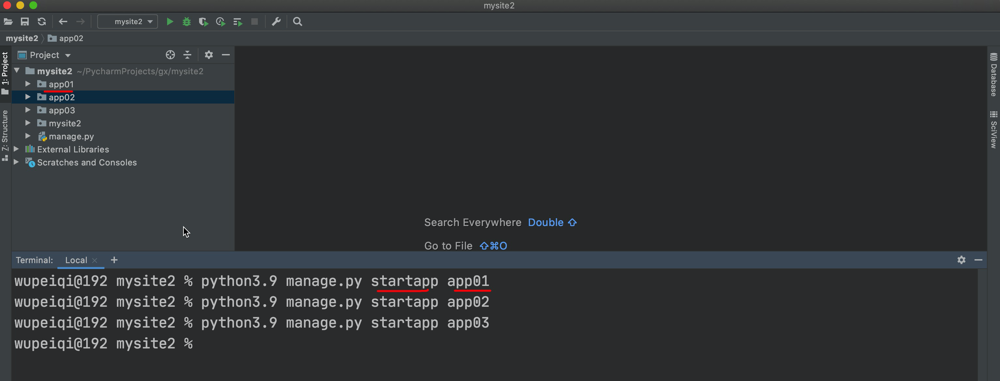
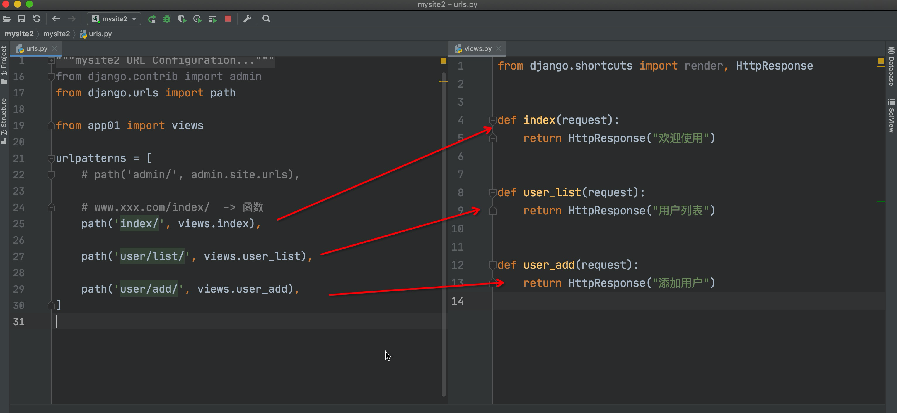
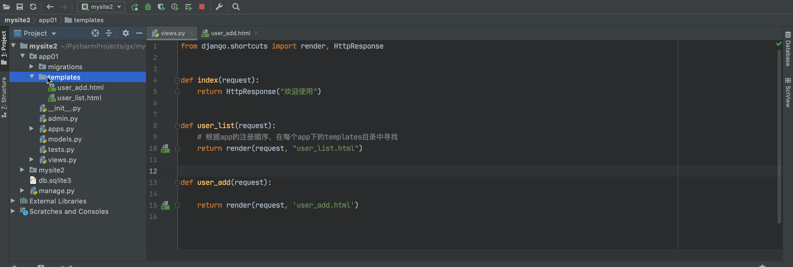
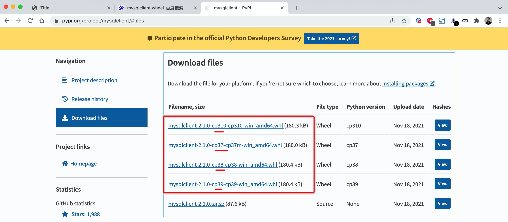
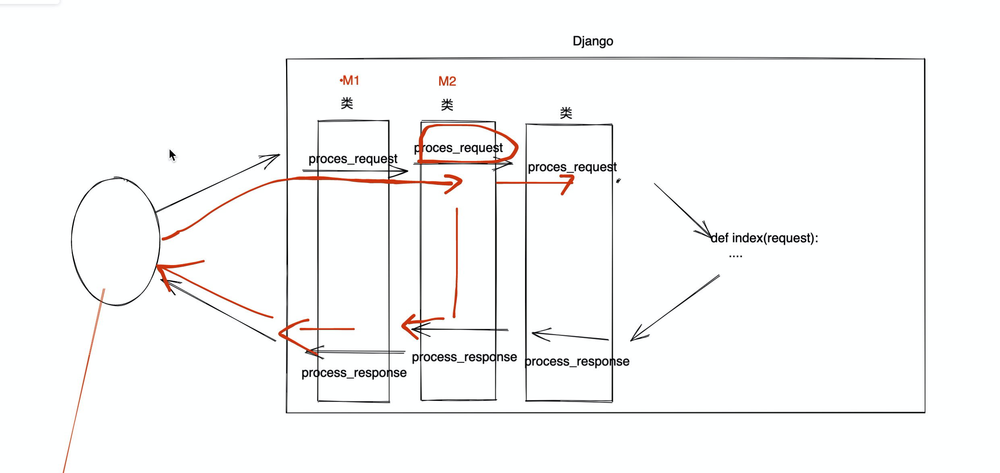

# Django

## 简介

- Python知识点：函数、面向对象
- 前端开发：HTML、CSS、JavaScript、jQuery、BootStrap
- MySQL数据库
- Python的Web框架：
  - Flask，自身短小精悍 + 第三方组件
  - Django，内部已集成了很多组件 +  第三方组件

**安装**

```
pip install django
```

**创建项目**

> django中项目会有一些默认的文件和默认的文件夹

**在终端**

- 打开终端

- 进入某个目录（项目放在哪里）

  ```
  /Users/wupeiqi/PycharmProjects/gx
  ```

- 执行命令创建项目

  ```
  "c:\python39\Scripts\django-admin.exe" startproject 项目名称
  ```

  ```
  # 如果 c:\python39\Scripts 已加入环境系统环境变量。
  
  django-admin startproject 项目名称
  ```

  ```
  # 我自己的电脑
  /Library/Frameworks/Python.framework/Versions/3.9/bin/django-admin startproject mysite
  ```

**Pycharm**

注意：

```
- Python解释器安装目录：C:\python39\python.exe lib....
	/Library/Frameworks/Python.framework/Versions/3.9/
	
- F:\pycode\ (基于Django创建的项目)
	/Users/wupeiqi/PycharmProjects
```


特殊说明：

- 命令行，创建的项目是标准的

- pycharm，在标准的基础上默认给咱们加了点东西

  - 创建了一个templates目录【删除】

  - settings.py中【删除】
    

默认项目的文件介绍：

```
mysite
├── manage.py         【项目的管理，启动项目、创建app、数据管理】【不要动】【***常常用***】
└── mysite
    ├── __init__.py
    ├── settings.py    【项目配置】          【***常常修改***】
    ├── urls.py        【URL和函数的对应关系】【***常常修改***】
    ├── asgi.py        【接收网络请求】【不要动】
    └── wsgi.py        【接收网络请求】【不要动】
```

**创建 app**

```
- 项目
	- app，用户管理【表结构、函数、HTML模板、CSS】
	- app，订单管理【表结构、函数、HTML模板、CSS】
	- app，后台管理【表结构、函数、HTML模板、CSS】
	- app，网站   【表结构、函数、HTML模板、CSS】
	- app，API    【表结构、函数、HTML模板、CSS】
	..
	
注意：我们开发比较简洁，用不到多app，一般情况下，项目下创建1个app即可。
```



```
├── app01
│   ├── __init__.py
│   ├── admin.py         【固定，不用动】django默认提供了admin后台管理。
│   ├── apps.py          【固定，不用动】app启动类
│   ├── migrations       【固定，不用动】数据库变更记录
│   │   └── __init__.py
│   ├── models.py        【**重要**】，对数据库操作。
│   ├── tests.py         【固定，不用动】单元测试
│   └── views.py         【**重要**】，函数。
├── manage.py
└── mysite2
    ├── __init__.py
    ├── asgi.py
    ├── settings.py
    ├── urls.py          【URL->函数】
    └── wsgi.py
```

## 快速上手

- 确保app已注册 【settings.py】
  

- 编写URL和视图函数对应关系 【urls.py】
  

- 编写视图函数 【views.py】
  

- 启动`django`项目

  - 命令行启动

    ```
    python manage.py runserver 
    ```

  - Pycharm 启动
    

**再写一个页面**

```
- url -> 函数
- 函数
```



**templates 模板**



**静态文件**

在开发过程中一般将：

- 图片
- CSS
- js

当做静态文件处理

**static目录**

在app目录下创建static文件夹


**引用静态文件**


## 模板语法

本质上：在HTML中写一些占位符，由数据对这些占位符进行替换和处理


**伪联通新闻中心**


## 请求和响应


关于重定向：


**案例：用户登录**


## 数据库操作

- MySQL数据库 + pymysql

  ```python
  import pymysql
  
  # 1.连接MySQL
  conn = pymysql.connect(host="127.0.0.1", port=3306, user='root', passwd="root123", charset='utf8', db='unicom')
  cursor = conn.cursor(cursor=pymysql.cursors.DictCursor)
  
  # 2.发送指令
  cursor.execute("insert into admin(username,password,mobile) values('wupeiqi','qwe123','15155555555')")
  conn.commit()
  
  # 3.关闭
  cursor.close()
  conn.close()
  ```

- Django开发操作数据库更简单，内部提供了ORM框架。
  

### **安装第三方模块**

```
pip install mysqlclient
```



### ORM

ORM可以帮助我们做两件事：

- 创建、修改、删除数据库中的表（不用你写SQL语句） 【无法创建数据库】

- 操作表中的数据（不用写SQL语句）

  

#### 创建数据库

- 启动MySQL服务

- 自带工具创建数据库

  ```
  create database gx_day15 DEFAULT CHARSET utf8 COLLATE utf8_general_ci;
  ```


#### django连接数据库

在settings.py文件中进行配置和修改。

```python
DATABASES = {
    'default': {
        'ENGINE': 'django.db.backends.mysql',
        'NAME': 'gx_day15',  # 数据库名字
        'USER': 'root',
        'PASSWORD': 'root123',
        'HOST': '127.0.0.1',  # 那台机器安装了MySQL
        'PORT': 3306,
    }
}
```


#### django操作表

- 创建表
- 删除表
- 修改表

创建表：在models.py文件中


```sql
create table app01_userinfo(
    id bigint auto_increment primary key,
    name varchar(32),
    password varchar(64),
    age int
)
```


执行命令：

```
python3.9 manage.py makemigrations
python3.9 manage.py migrate
```

注意：app需要提前注册。


在表中新增列时，由于已存在列中可能已有数据，所以新增列必须要指定新增列对应的数据：

- 1，手动输入一个值。

- 设置默认值

  ```
  age = models.IntegerField(default=2)
  ```

- 允许为空

  ```
  data = models.IntegerField(null=True, blank=True)
  ```

以后在开发中如果想要对表结构进行调整：

- 在models.py文件中操作类即可。

- 命令

  ```
  python3.9 manage.py makemigrations
  python3.9 manage.py migrate
  ```


**表中的数据**

```python
# #### 1.新建 ####
# Department.objects.create(title="销售部")
# Department.objects.create(title="IT部")
# Department.objects.create(title="运营部")
# UserInfo.objects.create(name="武沛齐", password="123", age=19)
# UserInfo.objects.create(name="朱虎飞", password="666", age=29)
# UserInfo.objects.create(name="吴阳军", password="666")

# #### 2.删除 ####
# UserInfo.objects.filter(id=3).delete()
# Department.objects.all().delete()

# #### 3.获取数据 ####
# 3.1 获取符合条件的所有数据
# data_list = [对象,对象,对象]  QuerySet类型
# data_list = UserInfo.objects.all()
# for obj in data_list:
#     print(obj.id, obj.name, obj.password, obj.age)

# data_list = [对象,]
# data_list = UserInfo.objects.filter(id=1)
# print(data_list)
# 3.1 获取第一条数据【对象】
# row_obj = UserInfo.objects.filter(id=1).first()
# print(row_obj.id, row_obj.name, row_obj.password, row_obj.age)


# #### 4.更新数据 ####
# UserInfo.objects.all().update(password=999)
# UserInfo.objects.filter(id=2).update(age=999)
# UserInfo.objects.filter(name="朱虎飞").update(age=999)
```

**用户管理**

1. 展示用户列表

- url
- 函数
  - 获取所有用户信息
  - HTML渲染

2. 添加用户

- url
- 函数
  - GET，看到页面，输入内容。
  - POST，提交 -> 写入到数据库。

3. 删除用户

- url
- 函数

````
http://127.0.0.1:8000/info/delete/?nid=1
http://127.0.0.1:8000/info/delete/?nid=2
http://127.0.0.1:8000/info/delete/?nid=3

def 函数(request):
	nid = reuqest.GET.get("nid")
	UserInfo.objects.filter(id=nid).delete()
	return HttpResponse("删除成功")
````

## 中间件



- 定义中间件

  ```python
  from django.utils.deprecation import MiddlewareMixin
  from django.shortcuts import HttpResponse
  
  class M1(MiddlewareMixin):
      """ 中间件1 """
  
      def process_request(self, request):
  
          # 如果方法中没有返回值（返回None），继续向后走
          # 如果有返回值 HttpResponse、render 、redirect
          print("M1.process_request")
          return HttpResponse("无权访问")
  
      def process_response(self, request, response):
          print("M1.process_response")
          return response
  
  
  class M2(MiddlewareMixin):
      """ 中间件2 """
  
      def process_request(self, request):
          print("M2.process_request")
  
      def process_response(self, request, response):
          print("M2.process_response")
          return response
  ```

- 应用中间件 setings.py

  ```python
  MIDDLEWARE = [
      'django.middleware.security.SecurityMiddleware',
      'django.contrib.sessions.middleware.SessionMiddleware',
      'django.middleware.common.CommonMiddleware',
      'django.middleware.csrf.CsrfViewMiddleware',
      'django.contrib.auth.middleware.AuthenticationMiddleware',
      'django.contrib.messages.middleware.MessageMiddleware',
      'django.middleware.clickjacking.XFrameOptionsMiddleware',
      'app01.middleware.auth.M1',
      'app01.middleware.auth.M2',
  ]
  ```

- 在中间件的process_request方法

  ```python
  # 如果方法中没有返回值（返回None），继续向后走
  # 如果有返回值 HttpResponse、render 、redirect，则不再继续向后执行。
  ```

  

### 实现登录校验

- 编写中间件

  ```python
  from django.utils.deprecation import MiddlewareMixin
  from django.shortcuts import HttpResponse, redirect
  
  
  class AuthMiddleware(MiddlewareMixin):
  
      def process_request(self, request):
          # 0.排除那些不需要登录就能访问的页面
          #   request.path_info 获取当前用户请求的URL /login/
          if request.path_info == "/login/":
              return
  
          # 1.读取当前访问的用户的session信息，如果能读到，说明已登陆过，就可以继续向后走。
          info_dict = request.session.get("info")
          print(info_dict)
          if info_dict:
              return
  
          # 2.没有登录过，重新回到登录页面
          return redirect('/login/')
  ```

- 应用中间件

  ```python
  MIDDLEWARE = [
      'django.middleware.security.SecurityMiddleware',
      'django.contrib.sessions.middleware.SessionMiddleware',
      'django.middleware.common.CommonMiddleware',
      'django.middleware.csrf.CsrfViewMiddleware',
      'django.contrib.auth.middleware.AuthenticationMiddleware',
      'django.contrib.messages.middleware.MessageMiddleware',
      'django.middleware.clickjacking.XFrameOptionsMiddleware',
      'app01.middleware.auth.AuthMiddleware',
  ]
  ```

  

## 关于文件上传

**基本操作**

```html
<form method="post" enctype="multipart/form-data">
    
    <input type="text" name="username">
    <input type="file" name="avatar">
    <input type="submit" value="提交">
</form>
```

```python
from django.shortcuts import render, HttpResponse


def upload_list(request):
    if request.method == "GET":
        return render(request, 'upload_list.html')

    # # 'username': ['big666']
    # print(request.POST)  # 请求体中数据
    # # {'avatar': [<InMemoryUploadedFile: 图片 1.png (image/png)>]}>
    # print(request.FILES)  # 请求发过来的文件 {}

    file_object = request.FILES.get("avatar")
    # print(file_object.name)  # 文件名：WX20211117-222041@2x.png

    f = open(file_object.name, mode='wb')
    for chunk in file_object.chunks():
        f.write(chunk)
    f.close()
    return HttpResponse("...")
```

**案例：批量上传数据**

```html
<form method="post" enctype="multipart/form-data" action="/depart/multi/">
    
    <div class="form-group">
        <input type="file" name="exc">
    </div>
    <input type="submit" value="上传" class="btn btn-info btn-sm">
</form>
```

```python
def depart_multi(request):
    """ 批量删除（Excel文件）"""
    from openpyxl import load_workbook

    # 1.获取用户上传的文件对象
    file_object = request.FILES.get("exc")

    # 2.对象传递给openpyxl，由openpyxl读取文件的内容
    wb = load_workbook(file_object)
    sheet = wb.worksheets[0]

    # 3.循环获取每一行数据
    for row in sheet.iter_rows(min_row=2):
        text = row[0].value
        exists = models.Department.objects.filter(title=text).exists()
        if not exists:
            models.Department.objects.create(title=text)

    return redirect('/depart/list/')
```

**案例：混合数据（Form）**

提交页面时：用户输入数据 + 文件（输入不能为空、报错）。

- Form生成HTML标签：type=file
- 表单的验证
- form.cleaned_data 获取 数据 + 文件对象

```html





    <div class="container">
        <div class="panel panel-default">
            <div class="panel-heading">
                <h3 class="panel-title"> {{ title }} </h3>
            </div>
            <div class="panel-body">
                <form method="post" enctype="multipart/form-data" novalidate >
                    

                    
                        <div class="form-group">
                            <label>{{ field.label }}</label>
                            {{ field }}
                            <span style="color: red;">{{ field.errors.0 }}</span>
                        </div>
                    

                    <button type="submit" class="btn btn-primary">提 交</button>
                </form>
            </div>
        </div>
    </div>



```

```python
from django import forms
from app01.utils.bootstrap import BootStrapForm


class UpForm(BootStrapForm):
    bootstrap_exclude_fields = ['img']

    name = forms.CharField(label="姓名")
    age = forms.IntegerField(label="年龄")
    img = forms.FileField(label="头像")


def upload_form(request):
    title = "Form上传"
    if request.method == "GET":
        form = UpForm()
        return render(request, 'upload_form.html', {"form": form, "title": title})

    form = UpForm(data=request.POST, files=request.FILES)
    if form.is_valid():
        # {'name': '武沛齐', 'age': 123, 'img': <InMemoryUploadedFile: 图片 1.png (image/png)>}
        # 1.读取图片内容，写入到文件夹中并获取文件的路径。
        image_object = form.cleaned_data.get("img")

        # file_path = "app01/static/img/{}".format(image_object.name)
        db_file_path = os.path.join("static", "img", image_object.name)

        file_path = os.path.join("app01", db_file_path)
        f = open(file_path, mode='wb')
        for chunk in image_object.chunks():
            f.write(chunk)
        f.close()

        # 2.将图片文件路径写入到数据库
        models.Boss.objects.create(
            name=form.cleaned_data['name'],
            age=form.cleaned_data['age'],
            img=db_file_path,
        )
        return HttpResponse("...")
    return render(request, 'upload_form.html', {"form": form, "title": title})

```


注意：就目前而言，所有的静态文件都只能放在static目录。


在django的开发过程中两个特殊的文件夹：

- static，存放静态文件的路径，包括：CSS、JS、项目图片。
- media，用户上传的数据的目录。

### 启用media

在urls.py中进行配置：

```
from django.urls import path, re_path
from django.views.static import serve
from django.conf import settings

urlpatterns = [
	re_path(r'^media/(?P<path>.*)$', serve, {'document_root': settings.MEDIA_ROOT}, name='media'),
]
```

在settings.py中进行配置：

```
import os

MEDIA_ROOT = os.path.join(BASE_DIR, "media")
MEDIA_URL = "/media/"
```


在浏览器上访问这个地址：


**混合数据（form）**

```python
from django import forms
from app01.utils.bootstrap import BootStrapForm


class UpForm(BootStrapForm):
    bootstrap_exclude_fields = ['img']

    name = forms.CharField(label="姓名")
    age = forms.IntegerField(label="年龄")
    img = forms.FileField(label="头像")


def upload_form(request):
    title = "Form上传"
    if request.method == "GET":
        form = UpForm()
        return render(request, 'upload_form.html', {"form": form, "title": title})

    form = UpForm(data=request.POST, files=request.FILES)
    if form.is_valid():
        # {'name': '武沛齐', 'age': 123, 'img': <InMemoryUploadedFile: 图片 1.png (image/png)>}
        # 1.读取图片内容，写入到文件夹中并获取文件的路径。
        image_object = form.cleaned_data.get("img")

        # media_path = os.path.join(settings.MEDIA_ROOT, image_object.name)
        media_path = os.path.join("media", image_object.name)
        f = open(media_path, mode='wb')
        for chunk in image_object.chunks():
            f.write(chunk)
        f.close()

        # 2.将图片文件路径写入到数据库
        models.Boss.objects.create(
            name=form.cleaned_data['name'],
            age=form.cleaned_data['age'],
            img=media_path,
        )
        return HttpResponse("...")
    return render(request, 'upload_form.html', {"form": form, "title": title})
```

**案例：混合数据（ModalForm)**

models.py

```python
class City(models.Model):
    """ 城市 """
    name = models.CharField(verbose_name="名称", max_length=32)
    count = models.IntegerField(verbose_name="人口")

    # 本质上数据库也是CharField，自动保存数据。
    img = models.FileField(verbose_name="Logo", max_length=128, upload_to='city/')
```

定义ModelForm

```python
from app01.utils.bootstrap import BootStrapModelForm


class UpModelForm(BootStrapModelForm):
    bootstrap_exclude_fields = ['img']

    class Meta:
        model = models.City
        fields = "__all__"
```

视图

```python
def upload_modal_form(request):
    """ 上传文件和数据（modelForm）"""
    title = "ModelForm上传文件"
    if request.method == "GET":
        form = UpModelForm()
        return render(request, 'upload_form.html', {"form": form, 'title': title})

    form = UpModelForm(data=request.POST, files=request.FILES)
    if form.is_valid():
        # 对于文件：自动保存；
        # 字段 + 上传路径写入到数据库
        form.save()
        
        return HttpResponse("成功")
    return render(request, 'upload_form.html', {"form": form, 'title': title})
```


